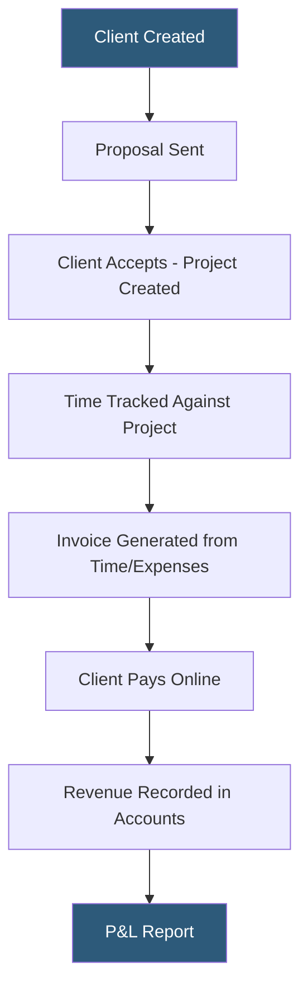

**Category:** Accounting Software Platforms
**Difficulty:** Beginner
**Reading time:** 6 min read

---

FreshBooks is a cloud accounting platform designed for self-employed professionals and small service businesses, with an emphasis on invoicing, time tracking, and client communication rather than complex double-entry accounting. It holds particular appeal for creative professionals, consultants, and agency owners who prioritize client-facing workflow over back-office accounting depth.

- **Client-centric design** — FreshBooks organizes the workflow around clients rather than accounts, making it intuitive for service business owners without accounting backgrounds
- **Customizable invoices** — branded invoice templates with client portal payment, automatic late payment reminders, and online payment acceptance
- **Time tracking** — built-in timer and timesheet module that links tracked hours directly to invoices for billable hour businesses
- **Double-entry accounting** — FreshBooks added full double-entry bookkeeping in 2019, but the interface abstracts it; users interact with invoices and expenses rather than debits/credits
- **Proposals** — project scope and pricing documents sent to prospective clients that convert to projects and invoices upon acceptance

FreshBooks' architecture puts invoicing and client management at the center. The client record links together all invoices, estimates, projects, time entries, and communication for each client. Invoice templates support custom branding, multiple currencies, and automatic reminders at configurable intervals before and after due dates. Payment portals accept credit cards and ACH via FreshBooks Payments (Stripe-powered) or integrations with PayPal, Stripe, and GoCardless.

Time tracking integrates tightly with invoicing: timers started against a project automatically populate unbilled time entries that appear when creating the next invoice. Billable items are checked by default; non-billable items remain in the project record for utilization tracking. The mobile app includes the timer, making on-the-go time capture practical.

FreshBooks added a proper double-entry accounting layer in version 3 (2019), replacing the simpler single-entry approach. The journal and accounts are now proper double-entry, enabling balance sheets and accurate financial reporting. However, the interface hides this complexity — users do not see journal entries when creating invoices or recording expenses.

- Graphic designer billing clients for time and materials with custom branded invoices
- Consultant sending proposals, tracking project time, and invoicing from a single tool
- Small agency with 3–5 clients needing time tracking linked to retainer invoicing
- Freelancer accepting online payments and automating late payment reminder emails

| Advantage | Disadvantage |
|-----------|--------------|
| The most intuitive invoicing and client workflow among small business accounting tools | Inventory and product-based business features are limited compared to QBO or Xero |
| Proposal to invoice to payment workflow in one platform | More expensive than Wave for businesses that just need basic accounting and invoicing |
| Time tracking directly linked to billing eliminates timesheet to invoice transfer | Double-entry accounting layer is present but less accessible for advanced accounting needs |

- [FreshBooks Lite Plan](freshbooks-lite-plan.md)
- [Wave Accounting Platform](wave-accounting-platform.md)
- [Xero Accounting Platform](xero-accounting-platform.md)

---
*Part of the [Accounting Software Platforms](index.md) category · [Back to Master Index](../../index.md)*
