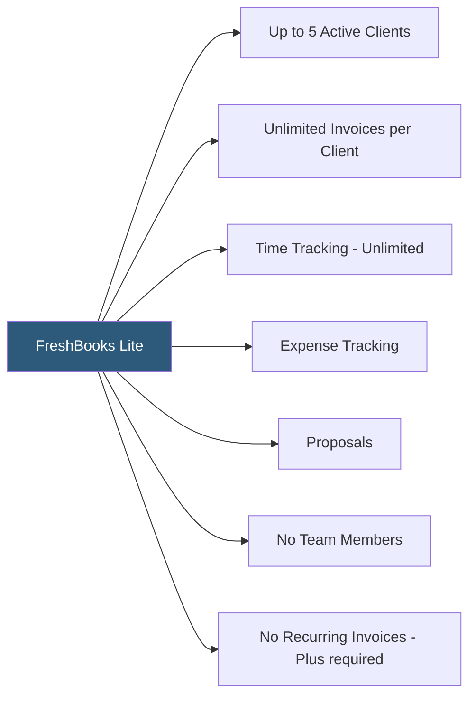

**Category:** Accounting Software Platforms
**Difficulty:** Beginner
**Reading time:** 5 min read

---

FreshBooks Lite is the entry-level FreshBooks subscription limiting billing to 5 active clients, designed for freelancers and sole proprietors with a small, stable client base who need invoicing and basic expense tracking without more expensive tiers. It represents FreshBooks' lowest barrier to entry for professional invoicing.

- **5 active clients** — the defining limit of the Lite plan; businesses with more than 5 clients needing invoicing must upgrade to Plus
- **Active client** — a client who has had an invoice sent to them in the past 12 months; archived clients do not count toward the limit
- **Unlimited invoices to active clients** — within the 5-client limit, there is no cap on the number of invoices created per client
- **Time tracking** — Lite includes FreshBooks' timer and time entry features without restriction
- **Proposals** — available at Lite tier, enabling formal project quotes to potential clients

The 5-client limit counts clients with invoices sent in the past 12 months as "active." Archiving a client removes them from the count and allows adding a new one, but archived client history remains in the account. For project-based businesses with a rotating client roster, the archiving workflow can extend the Lite plan's utility beyond its nominal limitation.

Lite lacks a few features available in higher tiers: recurring invoices (must be on Plus), double-entry reports (only some reports available at Lite), scheduled payment reminders (Plus), and team member seats. The double-entry accounting journal and formal balance sheet may require Plus in some FreshBooks account configurations depending on activation date.

FreshBooks Lite costs approximately $17–$19/month (billed monthly) or less with annual billing. For freelancers who consistently work with fewer than 5 concurrent clients, Lite provides full FreshBooks invoicing and time tracking functionality at the minimum price.

- Freelance writer with 3 regular magazine clients billing monthly retainer fees
- Photographer billing 2–4 clients per event season with project proposals and invoices
- Part-time consultant with fewer than 5 active clients at any time
- Startup founder billing pilot customers before hiring a bookkeeper and upgrading plans

| Advantage | Disadvantage |
|-----------|--------------|
| Full FreshBooks invoicing quality at minimum price | 5-client cap requires upgrading or archiving clients as the business grows |
| Time tracking and proposals available without restriction | No recurring invoices at Lite tier; must upgrade for subscription billing clients |
| Archiving inactive clients effectively extends the plan's utility | No team member seats; suitable only for single-operator businesses |

- [FreshBooks Accounting Software](freshbooks-accounting-software.md)
- [FreshBooks Plus Plan](freshbooks-plus-plan.md)
- [Wave Accounting Platform](wave-accounting-platform.md)

---
*Part of the [Accounting Software Platforms](index.md) category · [Back to Master Index](../../index.md)*
