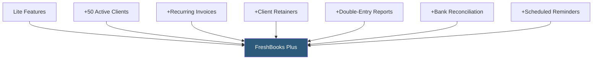

**Category:** Accounting Software Platforms
**Difficulty:** Beginner
**Reading time:** 5 min read

---

FreshBooks Plus expands the Lite plan to 50 active clients and adds key features for growing service businesses — recurring invoices, double-entry reports, scheduled payment reminders, client retainers, and basic business health reporting — making it the most popular FreshBooks tier for established freelancers and small agencies.

- **50 active clients** — Plus increases the active client limit tenfold from Lite's 5, accommodating most growing service businesses
- **Recurring invoices** — automatically generated and sent invoices on weekly, monthly, or custom schedules for subscription and retainer clients
- **Client retainers** — pre-paid retainer management where clients purchase a block of hours upfront, and FreshBooks tracks retainer usage and balance
- **Double-entry accounting reports** — the full balance sheet, general ledger, trial balance, and chart of accounts reports available
- **Bank account reconciliation** — comparing imported bank transactions against FreshBooks records to ensure books match bank statements

Recurring invoices in Plus are configured with a start date, frequency (weekly, bi-weekly, monthly, yearly), and end date or number of occurrences. On the scheduled date, FreshBooks creates the invoice and either saves it as a draft for review or sends it automatically to the client, depending on the configuration. The client sees a standard invoice with the same payment options as manual invoices.

Client retainers allow businesses to sell pre-purchased time blocks. A client buys 10 hours at the agreed rate; FreshBooks tracks the retainer balance and deducts hours as time entries are logged against the retainer. When the balance runs low, FreshBooks sends an automatic renewal notification. Invoices for additional retainer purchases are generated from the retainer management interface.

Bank reconciliation in Plus imports transactions from connected bank accounts and presents them alongside FreshBooks income and expense records. The reconciliation view flags unmatched items requiring review and allows creating missing expense records directly from the bank statement line.

- Agency with 30 retainer clients billing monthly recurring fees via automated invoice delivery
- Consultant managing pre-purchased hour blocks for 10+ clients with automated retainer renewal notifications
- Freelancer with growing client roster needing double-entry reports for year-end tax preparation
- Service business using bank reconciliation to ensure expense records match actual bank charges

| Advantage | Disadvantage |
|-----------|--------------|
| Recurring invoices eliminate manual monthly billing for subscription clients | 50-client limit still constrains rapidly growing businesses; Premium needed for unlimited |
| Client retainer management is a differentiator versus QBO and Xero for time-based billing | Payroll integration and team collaboration features require Premium plan |
| Bank reconciliation ensures books accuracy for tax preparation | Reporting depth less than QBO Plus or Xero for businesses needing class tracking or project P&L |

- [FreshBooks Lite Plan](freshbooks-lite-plan.md)
- [FreshBooks Premium Plan](freshbooks-premium-plan.md)
- [Xero Standard Plan](xero-standard-plan.md)

---
*Part of the [Accounting Software Platforms](index.md) category · [Back to Master Index](../../index.md)*
