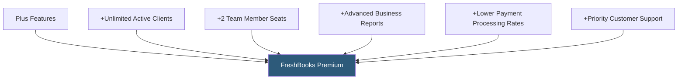

**Category:** Accounting Software Platforms
**Difficulty:** Intermediate
**Reading time:** 5 min read

---

FreshBooks Premium removes all client limits (unlimited active clients), adds team collaboration with up to 2 included team member seats, and provides advanced business insights, making it the appropriate tier for established agencies and service businesses with large client rosters and multiple staff needing accounting access.

- **Unlimited active clients** — Premium has no restriction on the number of clients who can be actively invoiced
- **2 team member seats** — Premium includes two additional user seats for staff who need invoice creation, time tracking, or expense submission access
- **Business health reports** — expanded P&L and cash flow reports with trend comparison across multiple time periods
- **Accountant access** — a dedicated invitation for an accounting firm to access the FreshBooks file at no additional user cost
- **Advanced payment features** — ACH bank payment options and lower processing rates on FreshBooks Payments available at Premium

Premium's unlimited client model removes the planning overhead of tracking active vs archived clients. Businesses can maintain full history for every client they have ever worked with without client management overhead. The billing is based entirely on the plan rate rather than client count, simplifying cost forecasting.

Team member seats allow employees to access FreshBooks with defined permissions. In FreshBooks' permission model, team members can create and send invoices, track time, and submit expenses, but cannot access financial reports or account settings by default. Permissions are configurable per team member. Additional seats beyond the 2 included are available at per-seat pricing.

Business health reporting in Premium adds multi-period P&L comparisons, gross margin tracking, and a cash position summary that helps business owners understand financial trajectory without requiring accounting expertise. These reports are designed to be readable by non-accountants, presenting data in plain language alongside financial figures.

- Small agency with 100+ active client accounts needing unlimited invoicing without client management overhead
- Consulting firm adding a junior consultant to the FreshBooks account for invoice creation and time tracking
- Growing service business where both the owner and an office manager need simultaneous FreshBooks access
- Business owner comparing business health metrics month-over-month without consulting an accountant

| Advantage | Disadvantage |
|-----------|--------------|
| Unlimited clients removes planning friction for growing businesses | 2 team member seats still limited; growing teams need Select plan or per-seat purchases |
| Business health reports accessible to non-accounting owners | Still primarily a service business tool; inventory and manufacturing needs require QBO or Xero |
| Priority customer support reduces resolution time for billing and technical issues | More expensive than Xero Standard for similar feature coverage with unlimited users |

- [FreshBooks Plus Plan](freshbooks-plus-plan.md)
- [FreshBooks Select Plan](freshbooks-select-plan.md)
- [QuickBooks Online Plus](quickbooks-online-plus.md)

---
*Part of the [Accounting Software Platforms](index.md) category · [Back to Master Index](../../index.md)*
