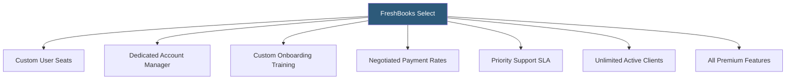

**Category:** Accounting Software Platforms
**Difficulty:** Intermediate
**Reading time:** 5 min read

---

FreshBooks Select is a custom-quoted enterprise tier providing dedicated account management, custom onboarding, lower payment processing rates, and flexible team member seat counts for larger organizations that have outgrown the fixed-tier plans. It targets agencies and professional services firms with complex billing workflows and significant payment processing volume.

- **Custom pricing** — Select pricing is negotiated based on team size, payment volume, and feature requirements rather than a published rate
- **Dedicated account manager** — a named FreshBooks contact providing priority support, training, and quarterly business reviews
- **Custom team member seats** — Select provides the number of user seats negotiated at contract, beyond the 2 included in Premium
- **Reduced payment processing rates** — negotiated payment rates below the standard 2.9% + $0.30 for businesses with high invoice payment volume
- **Custom branding integration** — expanded invoice and proposal customization options for brand-consistent client communications

FreshBooks Select customers work with a dedicated account manager during implementation — mapping the business workflow to FreshBooks capabilities, configuring the chart of accounts, setting up team member roles, and training staff. Unlike standard self-service onboarding, Select customers receive structured implementation support.

The negotiated payment processing rate is the financial incentive for high-volume businesses. A business processing $500,000/year in card payments saves $3,500–$5,000/year at a 0.5–1% lower rate compared to standard FreshBooks Payments pricing. This savings often offsets the Select plan premium over the published Premium plan rate.

Quarterly business reviews with the account manager provide a structured touchpoint for discussing feature needs, reviewing FreshBooks roadmap items, and addressing ongoing support requirements. Account managers also serve as escalation paths when standard support channels cannot resolve complex issues.

- Agency with 20 staff needing customized team roles and a structured onboarding program
- Professional services firm processing $1M+ annually in client payments seeking reduced card processing rates
- Business with complex retainer structures needing custom implementation support to configure workflows correctly
- Organization requiring SLA-backed support response times for billing-critical operations

| Advantage | Disadvantage |
|-----------|--------------|
| Negotiated payment rates generate ROI at significant volume | Pricing opacity makes it hard to compare cost without going through sales process |
| Dedicated account manager accelerates implementation and reduces support friction | Select remains FreshBooks-scope; not suitable for complex multi-entity or ERP-level accounting |
| Custom onboarding ensures proper setup for complex service billing workflows | Minimum commitment may not suit businesses with variable or declining revenue |

- [FreshBooks Premium Plan](freshbooks-premium-plan.md)
- [FreshBooks Accounting Software](freshbooks-accounting-software.md)
- [QuickBooks Online Advanced](quickbooks-online-advanced.md)

---
*Part of the [Accounting Software Platforms](index.md) category · [Back to Master Index](../../index.md)*
