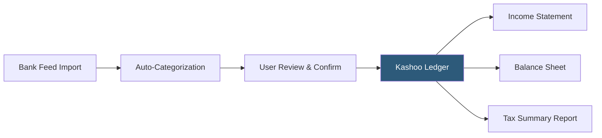

**Category:** Accounting Software Platforms
**Difficulty:** Beginner
**Reading time:** 4 min read

---

Kashoo is a simplified cloud accounting platform targeting freelancers and micro-businesses who need basic income and expense tracking without the feature complexity of QuickBooks or Xero. It offers a flat monthly subscription with unlimited users, positioning itself as the most straightforward double-entry accounting tool for non-accountants.

- **TrulySmall Accounting** — Kashoo's rebranded product line for the smallest businesses, offering automated transaction categorization with minimal manual entry
- **Bank feeds** — automatic import of bank and credit card transactions via Open Banking connections, reducing manual data entry to categorization and reconciliation
- **Flat-rate pricing** — Kashoo charges a single monthly fee regardless of user count, making it cost-effective for small teams needing shared accounting access
- **Double-entry engine** — Kashoo uses standard double-entry bookkeeping under the hood while presenting a simplified single-entry-style interface to end users
- **Multi-currency** — basic multi-currency invoicing and expense recording available without upgrading to higher tiers

Kashoo connects to bank accounts and credit cards via direct bank feeds, pulling transactions daily. The platform applies machine learning categorization to suggest income or expense categories for each transaction; users confirm or correct the suggestion with a single click. Confirmed transactions post to the double-entry ledger automatically, with Kashoo generating the offsetting entries behind the scenes.

Invoicing allows creation of professional invoices with payment links (via Stripe integration). When a customer pays, the invoice payment is matched to the incoming bank transaction and marked settled. Expense receipts can be captured via the mobile app and attached to categorized expenses for documentation.

Financial reports — income statement, balance sheet, and a tax summary showing income by category — generate in real time. Kashoo does not have a dedicated payroll module; payroll transactions are entered as expense journal entries or handled by a separate payroll provider.

The platform targets businesses with straightforward accounting needs: service businesses, freelancers, and sole proprietors with simple revenue streams and no inventory or project tracking requirements.

- Freelance graphic designer tracking client invoices and business expenses for quarterly estimated taxes
- Small retail shop owner needing basic income and expense records without inventory management
- Independent contractor wanting shared accounting access for themselves and their bookkeeper at no extra per-user cost
- Micro-business owner who found QuickBooks too complex and wants a single-screen accounting overview

| Advantage | Disadvantage |
|-----------|--------------|
| Flat-rate unlimited user pricing eliminates per-seat cost calculations | Very limited feature set — no inventory, payroll, or project tracking |
| Simpler interface than QuickBooks reduces onboarding time for non-accountants | Limited third-party integrations compared to QuickBooks or Xero ecosystems |
| Automated bank feed categorization reduces daily bookkeeping time | Reporting depth insufficient for businesses needing segmented or departmental financials |

- [Wave Free Accounting Software](wave-free-accounting-software.md)
- [FreshBooks Lite Plan](freshbooks-lite-plan.md)
- [QuickBooks Self-Employed](quickbooks-self-employed.md)

---
*Part of the [Accounting Software Platforms](index.md) category · [Back to Master Index](../../index.md)*
