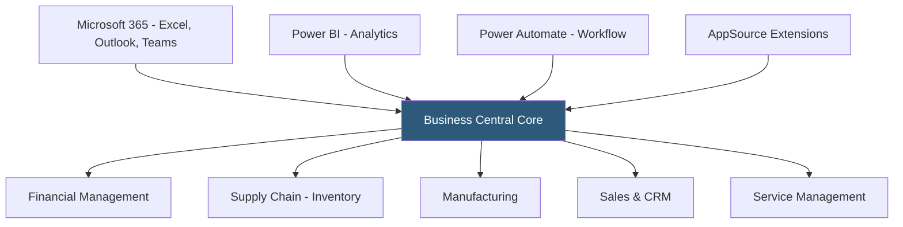

**Category:** Accounting Software Platforms
**Difficulty:** Advanced
**Reading time:** 6 min read

---

Microsoft Dynamics 365 Business Central (formerly Navision/NAV) is Microsoft's cloud ERP platform for small to mid-market businesses, deeply integrated with Microsoft 365, Power BI, and Azure services, providing finance, supply chain, manufacturing, sales, and service management in a unified platform. It matters as the ERP of choice for Microsoft-ecosystem organizations that want native Office 365 integration and Power Platform extensibility.

- **Dimensions** — Business Central's equivalent of Sage Intacct's dimensional tags; custom analysis codes attached to transactions enabling multi-dimensional financial reporting
- **AL language** — the programming language used to extend and customize Business Central through extensions, replacing older C/AL modifications
- **AppSource marketplace** — Microsoft's marketplace for Business Central extensions (3000+) from ISVs covering industry-specific functionality
- **Power BI integration** — native embedded Power BI reports and dashboards within Business Central's pages
- **Business Central SaaS** — the fully managed cloud version hosted by Microsoft on Azure, updated every 6 months with optional wave updates

Business Central's financial module uses a chart of accounts structured with dimensions — up to 8 custom dimensions (department, project, cost center, region, etc.) can be attached to every GL entry. These dimensions enable filtering and analysis of financial data without creating separate entities for each reporting segment, similar to Sage Intacct's dimensional model.

The Microsoft 365 integration is a genuine differentiator. Finance users can create sales invoices directly from Outlook emails, send invoices to vendors from within Excel using the Business Central Excel add-in, approve purchase orders from a Teams approval workflow, and access interactive financial reports embedded in Power BI Desktop without exporting. These integrations reflect native platform-level connections rather than third-party middleware.

Business Central uses a REST API (OData v4) exposing all business objects for integration with external systems. The Power Platform connection enables building automated workflows (Power Automate), custom apps (Power Apps), and BI reports (Power BI) without developer resources. AL extensions customize and extend Business Central's functionality through Microsoft's managed extension framework, avoiding direct code modifications that would break during upgrades.

- Microsoft-ecosystem company wanting native Teams approval workflows for purchase orders and expense reports
- Manufacturing business using embedded production order management with MRP (Material Requirements Planning)
- Professional services firm leveraging Power BI dashboards embedded directly in Business Central pages for real-time KPI visibility
- Multi-entity holding company consolidating 5 legal entities with dimension-based departmental P&L reporting

| Advantage | Disadvantage |
|-----------|--------------|
| Deepest Microsoft 365 and Power Platform integration of any mid-market ERP | Implementation complexity comparable to NetSuite; requires experienced partners |
| AppSource marketplace provides industry-specific extensions for most verticals | AL extension development requires specialized developers; fewer available than .NET developers |
| Microsoft's Azure infrastructure provides enterprise-grade reliability and compliance | SaaS update cadence (twice yearly) can disrupt extensions if not maintained |

- [Business Central Essentials](business-central-essentials.md)
- [NetSuite ERP Financials](netsuite-erp-financials.md)
- [Sage Intacct Cloud Financials](sage-intacct-cloud-financials.md)

---
*Part of the [Accounting Software Platforms](index.md) category · [Back to Master Index](../../index.md)*
