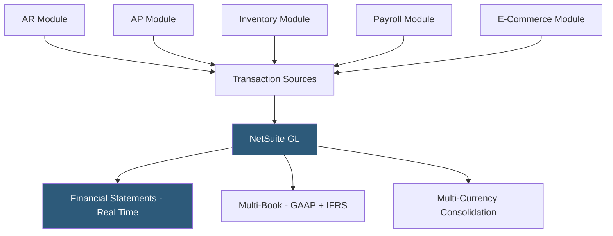

**Category:** Accounting Software Platforms
**Difficulty:** Advanced
**Reading time:** 5 min read

---

NetSuite's Accounting module is the financial management core of the NetSuite ERP platform, comprising the general ledger, accounts payable, accounts receivable, fixed asset management, and multi-currency capabilities that underpin all other NetSuite modules. Understanding it separately is relevant for teams evaluating NetSuite's financial capabilities relative to standalone accounting software.

- **Multi-book accounting** — maintaining parallel accounting records under different standards (GAAP, IFRS, local GAAP) simultaneously from the same transaction data
- **Financial statements** — real-time balance sheet, income statement, cash flow statement, and trial balance generated from the live GL without a batch process
- **Fixed asset management** — automated depreciation using straight-line, declining balance, or unit-of-production methods with automatic journal entry posting
- **Accounts payable automation** — bill approval workflows, three-way matching (PO/receipt/invoice), and payment batch creation with bank file generation
- **Tax management** — country-specific tax calculation rules for VAT, GST, and sales tax across 100+ countries in the OneWorld edition

NetSuite's GL is structured around accounts, segments (subsidiaries, departments, classes, locations), and accounting books. Every transaction in any NetSuite module generates GL impact lines automatically — a sales order fulfilled creates inventory reduction, COGS, revenue, and deferred revenue entries based on revenue recognition rules; a bill approved in AP posts the expense and liability; a payment generates the bank and liability entries.

The multi-book capability allows defining secondary accounting books with different period settings, currency conversion methods, or accounting principle rules. A primary GAAP book might capitalize software development costs while a secondary IFRS book expenses the same costs; both books update from the same transactions with different accounting treatment rules applied per book.

Period-end close in NetSuite is a managed workflow in the accounting period management module. Periods are locked progressively as sub-ledgers (AR, AP, inventory) are closed, preventing backdated transaction entry. Financial statements generate from any locked or open period without waiting for period-end batch processing.

- Finance team querying real-time P&L by department without waiting for a monthly close process
- Multi-GAAP organization maintaining simultaneous GAAP and IFRS books from a single transaction entry
- AP team processing 500 vendor invoices monthly with automated three-way matching against purchase orders
- Controller locking sub-ledgers sequentially during period-end without system downtime

| Advantage | Disadvantage |
|-----------|--------------|
| Real-time financial statements eliminate batch reporting delays | GL complexity (segments, books, currencies) requires experienced implementation | 
| Multi-book accounting handles parallel standard requirements without duplicate entry | Configuration changes to GL segments can have widespread impact requiring testing |
| All NetSuite modules write to the same GL, eliminating integration reconciliation | Reporting requires SuiteAnalytics training; standard reports insufficient for complex needs |

- [NetSuite ERP Financials](netsuite-erp-financials.md)
- [Sage Intacct Cloud Financials](sage-intacct-cloud-financials.md)
- [Microsoft Dynamics 365 Business Central](microsoft-dynamics-365-business-central.md)

---
*Part of the [Accounting Software Platforms](index.md) category · [Back to Master Index](../../index.md)*
