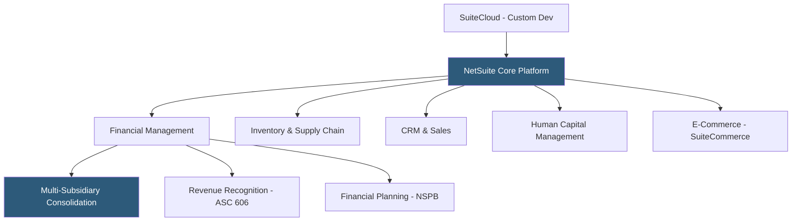

**Category:** Accounting Software Platforms
**Difficulty:** Advanced
**Reading time:** 7 min read

---

NetSuite is Oracle's cloud ERP platform serving 38,000+ organizations globally, integrating financial management, revenue recognition, inventory, CRM, e-commerce, and human resources in a single cloud system. It is the leading cloud ERP for mid-market companies and high-growth businesses that need a unified system of record across finance, operations, and customer management.

- **SuiteCloud** — NetSuite's customization and development platform including SuiteScript (JavaScript), SuiteFlow (workflow automation), and SuiteAnalytics (custom reporting)
- **Multi-subsidiary management** — consolidated management of multiple legal entities with automatic intercompany eliminations and real-time consolidation
- **Revenue recognition** — automated multi-element arrangement handling and compliance with ASC 606/IFRS 15 through NetSuite's Advanced Revenue Management module
- **OneWorld** — NetSuite's multi-subsidiary edition supporting 190+ currencies, 20+ languages, and country-specific tax compliance
- **SuiteAnalytics Workbooks** — NetSuite's self-service analytics environment for building custom reports and dashboards with access to all NetSuite data

NetSuite's financial management module is a multi-book general ledger supporting primary and secondary accounting books (e.g., GAAP and IFRS simultaneously), multiple currencies, and multi-subsidiary operations in a single instance. The GL is the system of record with all modules (inventory, CRM, e-commerce) feeding transactions directly into the accounting layer — eliminating integration middleware between operational and financial systems.

SuiteCloud enables deep customization without modifying base code. SuiteScript allows custom business logic (order validation rules, approval routing, data transformations), SuiteFlow enables visual workflow automation, and SuiteTalk provides REST and SOAP APIs for external system integration. This customization capability enables NetSuite to adapt to complex business requirements that cannot be addressed through configuration alone.

NetSuite Planning and Budgeting (NSPB) is an integrated financial planning module handling operating budgets, headcount planning, scenario modeling, and rolling forecasts with automatic synchronization to the NetSuite GL actuals for variance reporting without manual data transfer.

Implementation typically takes 3–6 months for mid-market businesses and requires either a NetSuite partner or dedicated in-house technical resources. Annual licensing ranges from $30,000 to $500,000+ depending on user count, subsidiary count, and modules.

- High-growth SaaS company managing multi-year subscription revenue recognition with ASC 606 compliance
- PE-backed mid-market company managing 12 portfolio subsidiaries with consolidated financial reporting
- E-commerce business operating online store, warehouse, and accounting in a single integrated platform
- Global company needing 15-country tax compliance, multi-currency, and multi-language in a single ERP instance

| Advantage | Disadvantage |
|-----------|--------------|
| Single platform eliminates integration overhead between finance, operations, and CRM | High implementation cost and complexity; failed NetSuite implementations are common |
| Real-time consolidation across 100+ subsidiaries without close process batch | Pricing scales significantly with users, subsidiaries, and modules |
| SuiteCloud enables customization to match virtually any business process | NetSuite requires dedicated administrators; not self-service at complexity levels |

- [Sage Intacct Cloud Financials](sage-intacct-cloud-financials.md)
- [Microsoft Dynamics 365 Business Central](microsoft-dynamics-365-business-central.md)
- [NetSuite Accounting Module](netsuite-accounting-module.md)

---
*Part of the [Accounting Software Platforms](index.md) category · [Back to Master Index](../../index.md)*
