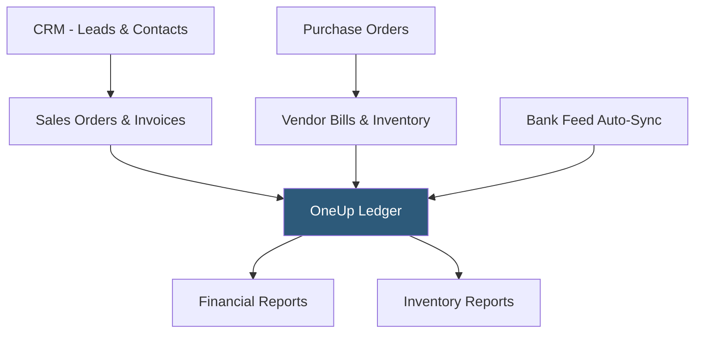

**Category:** Accounting Software Platforms
**Difficulty:** Intermediate
**Reading time:** 4 min read

---

OneUp is a cloud accounting and CRM platform targeting small businesses that need inventory management, sales pipeline tracking, and accounting in a single subscription. It differentiates by combining double-entry accounting with a built-in CRM and inventory system, positioning it between lightweight accounting tools and full ERP platforms.

- **Integrated CRM** — OneUp includes contact management, lead tracking, and sales pipeline features alongside accounting, eliminating the need for a separate CRM subscription for small teams
- **Inventory management** — perpetual inventory tracking with automatic COGS calculation, reorder points, and multi-location stock levels
- **Auto-sync** — automatic matching of bank transactions against open invoices and bills, reducing manual reconciliation effort
- **Purchase orders** — native purchase order workflow that creates vendor bills on receipt, maintaining accurate accrual-basis accounting
- **Mobile-first design** — OneUp's interface is designed for mobile use, enabling invoice creation, expense capture, and approval workflows from smartphones

OneUp's architecture connects the CRM, sales, inventory, and accounting modules so that each step in the order-to-cash and procure-to-pay processes updates the ledger automatically. A lead in the CRM converts to a quote, then a sales order, then an invoice; each stage change updates OneUp's pipeline view and prepares the accounting entry for when the invoice is issued.

Inventory management tracks item quantities using perpetual inventory. When a sales order is fulfilled and an invoice issued, OneUp debits COGS and credits inventory automatically based on average cost. Purchase orders received increase inventory and create vendor bills awaiting payment.

Bank feeds import transactions daily. OneUp's auto-sync compares imported transactions against open invoices and bills, suggesting matches. Confirmed matches mark invoices as paid and clear outstanding bills, with journal entries posted automatically.

The platform scales from a Self plan (1 user) through a Unlimited plan (unlimited users) at a fixed monthly fee, all including inventory and CRM without module-based pricing.

- Small product-based business needing inventory, sales, and accounting without separate ERP and CRM subscriptions
- Service business tracking a sales pipeline from lead to invoice in one platform
- Small distributor managing purchase orders and vendor bills with automatic inventory updates
- Mobile-first entrepreneur managing business finances from a smartphone without desktop software

| Advantage | Disadvantage |
|-----------|--------------|
| CRM and inventory included at all plan tiers without add-on costs | Less established than QuickBooks or Xero with smaller accountant adoption |
| Auto-sync reduces manual bank reconciliation effort | Advanced manufacturing or multi-entity features require a full ERP platform |
| Mobile-first design enables field-based business management | Integration ecosystem smaller than major platforms; fewer third-party connectors |

- [Zoho Books Accounting](zoho-books-accounting.md)
- [Wave Accounting Platform](wave-accounting-platform.md)
- [FreshBooks Accounting Software](freshbooks-accounting-software.md)

---
*Part of the [Accounting Software Platforms](index.md) category · [Back to Master Index](../../index.md)*
