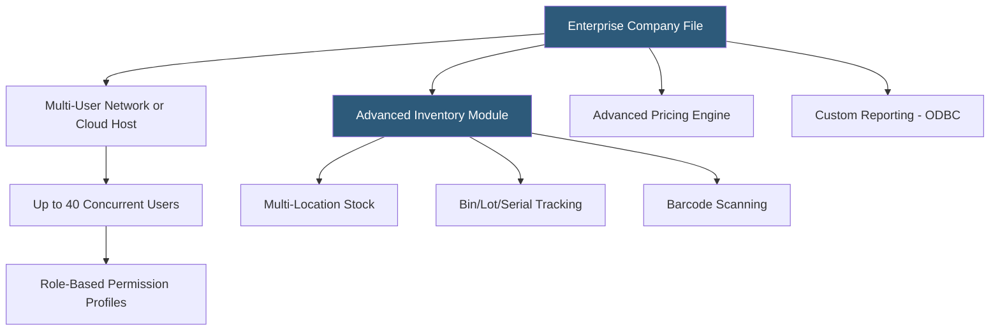

**Category:** Accounting Software Platforms
**Difficulty:** Advanced
**Reading time:** 6 min read

---

QuickBooks Desktop Enterprise is Intuit's most powerful Desktop product, supporting up to 40 concurrent users, advanced inventory with multi-location tracking, enhanced job costing, and role-based permissions across 150+ granular access controls. It targets mid-market businesses that need ERP-adjacent capabilities without the complexity and cost of NetSuite or Dynamics.

- **Advanced inventory** — multi-location inventory tracking, bin and serial/lot number tracking, FIFO costing, barcode scanning, and Sales Order Fulfillment Workflow
- **40-user access** — supports up to 40 concurrent named users with individual permission profiles, far beyond the 3/5-user limits of lower tiers
- **Role-based access control** — 150+ granular permissions covering every feature area, enabling principle-of-least-privilege access for each staff role
- **Advanced pricing** — rule-based pricing engine setting customer-specific, quantity-break, and time-limited price rules automatically at transaction entry
- **Cloud hosting** — optional hosting through Intuit's authorized hosting partners enabling web access to Desktop Enterprise files

Enterprise uses the same QuickBooks Desktop engine as Pro and Premier but scales the database capacity (300,000+ name records vs 14,500 in Pro), user concurrency, and feature set. The Advanced Inventory module adds warehouse management capabilities: multiple warehouse locations each with independent on-hand quantities, bin locations within warehouses, receiving workflows, and a mobile barcode scanning app that connects to the Desktop file via a cloud bridge.

The Advanced Pricing feature lets businesses define pricing rules that apply automatically during invoicing — customer-specific discount tiers, quantity breaks (orders >100 units get 15% off), contract pricing expiration dates, and promotional pricing windows. Without this feature, staff must manually apply discounts, creating override opportunities and pricing inconsistency.

Enterprise files can be hosted on local servers (traditional LAN multi-user) or through one of Intuit's authorized hosting partners (Right Networks, Swizznet, Ace Cloud Hosting), who provision remote desktop or Citrix environments running Enterprise on their infrastructure. This cloud hosting approach provides mobile access and eliminates the need for on-site server hardware while keeping the Desktop application and file intact.

- Mid-market distributor managing 5 warehouses with bin-level inventory, barcode receiving, and 20 simultaneous users
- Construction firm with 30 project managers needing separate permission profiles for field staff vs accounting staff
- Manufacturer using advanced pricing rules to manage 15 customer-specific price tiers automatically
- Business outgrowing QBO Plus/Advanced but not ready to invest in NetSuite implementation complexity

| Advantage | Disadvantage |
|-----------|--------------|
| 40-user access and advanced inventory at a fraction of ERP implementation costs | Annual subscription cost $1,200–$2,000+/year plus hosting if cloud access is required |
| ODBC connectivity enables custom reporting via external BI tools | Still a Desktop architecture; cloud access requires third-party hosting partners |
| Authorized hosting provides cloud access while preserving Desktop functionality | Long-term trajectory uncertain as Intuit shifts investment toward QBO |

- [QuickBooks Desktop Pro](quickbooks-desktop-pro.md)
- [NetSuite ERP Financials](netsuite-erp-financials.md)
- [Sage 100cloud](sage-100cloud.md)

---
*Part of the [Accounting Software Platforms](index.md) category · [Back to Master Index](../../index.md)*
