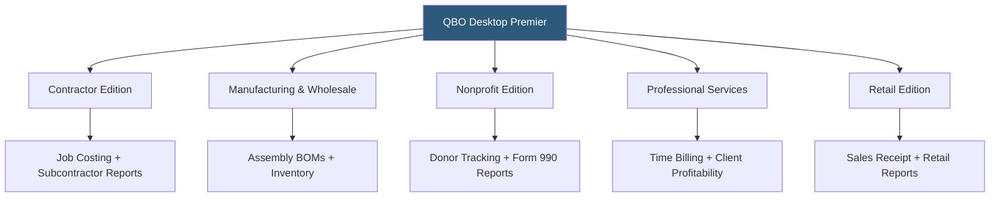

**Category:** Accounting Software Platforms
**Difficulty:** Intermediate
**Reading time:** 5 min read

---

QuickBooks Desktop Premier builds on Desktop Pro by adding industry-specific editions (Contractor, Manufacturing & Wholesale, Nonprofit, Professional Services, Retail) and expanding to five concurrent users, with more advanced inventory, sales order, and forecasting features. It matters for businesses that need industry-tailored chart of accounts, report templates, and workflows pre-configured for their sector.

- **Industry editions** — pre-configured versions with sector-specific chart of accounts, custom reports, and workflow templates for Contractor, Manufacturing, Nonprofit, Professional Services, and Retail industries
- **Sales orders** — Premier-exclusive feature for recording customer orders before fulfillment, enabling backorder tracking and picking lists
- **Forecasting** — income and expense forecasting tool for creating budget projections based on historical data
- **Inventory assembly** — defining finished goods as assemblies of component items, enabling basic bill of materials and build tracking
- **Five-user access** — Premier supports up to five concurrent network users, two more than Desktop Pro

Premier's industry editions provide pre-built configurations tailored to each sector. The Nonprofit edition includes a Statement of Financial Position (instead of Balance Sheet), program expense tracking, donor contribution reports, and Form 990 schedule export assistance. The Contractor edition adds cost-to-complete job reporting, equipment time tracking, and subcontractor insurance compliance tracking. The Manufacturing edition extends inventory with assembly items, where a finished product is defined as a combination of raw material components with manufacturing labor.

Sales orders, exclusive to Premier and Enterprise, allow businesses to record customer purchase orders as commitments before creating invoices. Sales orders flow into a picking workflow — lists of items to pull from inventory for each order — and generate backorder reports for items not in stock. This workflow supports order fulfillment operations not possible in Pro.

Forecasting in Premier uses the previous year's actual income and expense data to project future period performance. Users adjust percentage assumptions (growth rate, cost changes) and compare forecast vs budget vs actuals. The feature is more powerful than QBO's basic budget-to-actuals without the cost of external financial planning tools.

- Nonprofit organization using the Nonprofit edition for donor tracking and program expense reporting
- Small manufacturer using inventory assemblies to track bill-of-materials costs for finished goods
- Wholesale distributor using sales orders and inventory picking lists for order fulfillment workflows
- Construction contractor on the Contractor edition for subcontractor compliance and phase-level job costing

| Advantage | Disadvantage |
|-----------|--------------|
| Industry editions reduce chart of accounts setup time significantly | Must choose industry edition at setup; switching editions later is complex |
| Sales orders enable pre-fulfillment order management absent from QBO | Like all Desktop products, receives less investment as Intuit focuses on QBO |
| Five-user access suitable for small teams with shared accounting responsibilities | Significantly more expensive than Desktop Pro with limited differentiation for non-manufacturing use cases |

- [QuickBooks Desktop Pro](quickbooks-desktop-pro.md)
- [QuickBooks Desktop Enterprise](quickbooks-desktop-enterprise.md)
- [Sage 50cloud Accounting](sage-50cloud-accounting.md)

---
*Part of the [Accounting Software Platforms](index.md) category · [Back to Master Index](../../index.md)*
