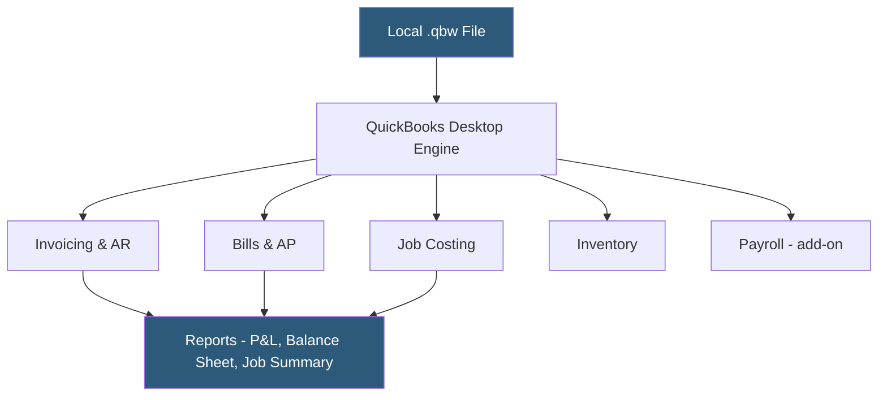

**Category:** Accounting Software Platforms
**Difficulty:** Intermediate
**Reading time:** 5 min read

---

QuickBooks Desktop Pro is Intuit's on-premise Windows accounting application for small businesses that prefer local data storage and do not require cloud access, offering more robust inventory and job costing features than QBO at its tier. It matters for businesses in industries with unreliable internet connectivity or data residency requirements that preclude cloud hosting.

- **One-time purchase vs subscription** — QuickBooks Desktop Pro was historically sold as a perpetual license; Intuit has migrated most Desktop products to annual subscriptions
- **Job costing** — tracking income and expenses against specific jobs or contracts to calculate per-job profitability with more detail than QBO's project feature
- **Three-user limit** — Desktop Pro supports up to three concurrent users accessing the same company file on a local network
- **Company file (.qbw)** — the proprietary database file stored locally or on a network share that contains all accounting data
- **Intuit Data Protect** — optional cloud backup service for Desktop company files

Desktop Pro stores all data in a proprietary local database (the .qbw file). Multi-user access is achieved by designating one machine as the host and opening the file in multi-user mode, allowing up to three workstations on the same LAN to access the file simultaneously. Performance depends on local hardware and network speed rather than internet connectivity.

Job costing in Desktop Pro is more granular than QBO's project feature — every transaction (time, materials, subcontractors, overhead allocations) can be assigned to a job and sub-job, and cost-to-complete reports compare estimated versus actual costs at each job phase. This capability makes Desktop Pro favored in construction, landscaping, and professional services industries that bill by project phases.

Intuit discontinued perpetual license sales for new Desktop versions in 2022, transitioning to an annual subscription model at approximately $350/year. Older perpetual license versions (pre-2022) still function but no longer receive updates, creating security and compatibility risks. Intuit has pushed users toward QBO through pricing adjustments and reduced feature investment in Desktop products.

- Construction contractor needing per-job cost tracking with phase-level budget vs actuals reporting
- Business in a location with unreliable internet connectivity requiring local data access
- CPA firm supporting legacy clients who built deep institutional workflows around Desktop Pro over many years
- Small manufacturer using Desktop Pro's item-level inventory tracking with assembly bills of materials

| Advantage | Disadvantage |
|-----------|--------------|
| More robust job costing than QBO equivalents | Requires local IT support for backups, network setup, and file maintenance |
| No reliance on internet connectivity for daily use | Intuit is actively migrating toward QBO; Desktop receives less feature investment |
| Better performance for high-transaction-volume companies on good hardware | Multi-user file sharing via network is less reliable than cloud-based concurrent access |

- [QuickBooks Desktop Enterprise](quickbooks-desktop-enterprise.md)
- [QuickBooks Online Platform](quickbooks-online-platform.md)
- [Sage 50cloud Accounting](sage-50cloud-accounting.md)

---
*Part of the [Accounting Software Platforms](index.md) category · [Back to Master Index](../../index.md)*
