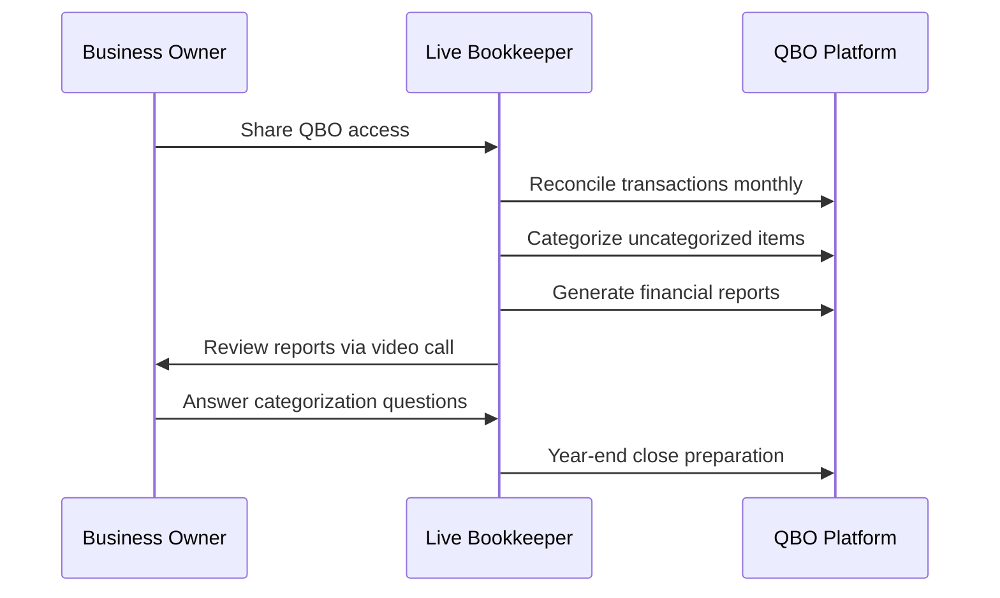

**Category:** Accounting Software Platforms
**Difficulty:** Beginner
**Reading time:** 5 min read

---

QuickBooks Live Bookkeeping is Intuit's managed bookkeeping service that pairs QBO subscribers with a team of Intuit-certified bookkeepers who perform monthly reconciliation, categorization, and financial reporting, eliminating the need for business owners to manage their own books. It matters as a hybrid software+service model that competes with independent bookkeepers for small business clients.

- **Certified bookkeeper** — an Intuit-trained professional who manages the client's QBO file and is accessible via video, phone, or chat
- **Monthly reconciliation** — the service deliverable where bookkeepers match all bank and credit card transactions to QBO records and resolve discrepancies
- **Cleanup service** — an initial engagement where bookkeepers bring disorganized or outdated QBO books current before starting ongoing service
- **Assisted bookkeeping** — QuickBooks Live's model where the bookkeeper works in the client's own QBO account rather than creating a separate file
- **Year-end close** — a final bookkeeping task completing all reconciliations and preparing the file for tax return preparation

When a QBO subscriber enrolls in QuickBooks Live, Intuit assigns a primary bookkeeper and a backup bookkeeper who have accountant-level access to the QBO company file. The bookkeeper logs into the client's QBO file each month, categorizes all uncategorized bank feed transactions, reconciles bank and credit card accounts, and reviews the chart of accounts for accuracy.

Monthly deliverables include a video call with the business owner to review the P&L, balance sheet, and cash flow statement. During the call, the bookkeeper identifies uncategorized transactions requiring owner input, flags unusual expense items, and answers questions about the financial reports. Communication outside the monthly call happens through the QBO in-app messaging system.

Pricing is tiered by monthly expense volume: businesses spending less than $10,000/month pay less than those spending $150,000+/month. The initial cleanup service is priced separately based on the number of months requiring reconciliation. Intuit positions the service at competitive rates versus independent bookkeepers in lower-cost markets, typically $200–$600/month depending on volume.

- Restaurant owner who wants clean books for tax time but has no time or interest in managing QBO categorizations
- Service business owner replacing a part-time bookkeeper to reduce payroll overhead
- E-commerce business with high transaction volume needing consistent monthly reconciliation
- New business owner who set up QBO but let it go uncategorized for 6 months needing cleanup + ongoing service

| Advantage | Disadvantage |
|-----------|--------------|
| Removes accounting burden from business owners who dislike bookkeeping | Less personalized than a dedicated independent bookkeeper who knows the business deeply |
| Intuit-trained bookkeepers ensure consistent QBO methodology | Bookkeeper assignment is partially random; relationship continuity can be inconsistent |
| Competitive pricing for straightforward service businesses | Does not include payroll processing, tax filing, or advisory services |

- [QuickBooks Online Platform](quickbooks-online-platform.md)
- [Wave Accounting Platform](wave-accounting-platform.md)
- [FreshBooks Accounting Software](freshbooks-accounting-software.md)

---
*Part of the [Accounting Software Platforms](index.md) category · [Back to Master Index](../../index.md)*
