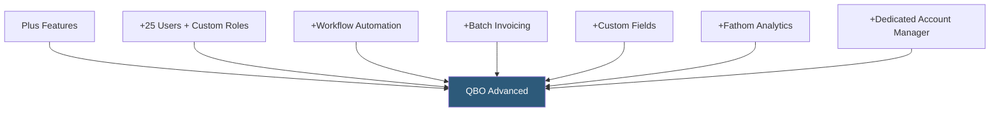

**Category:** Accounting Software Platforms
**Difficulty:** Intermediate
**Reading time:** 6 min read

---

QuickBooks Online Advanced is QBO's top tier for growing businesses, supporting 25 users and adding custom workflow automation, batch invoicing/expense entry, advanced reporting with custom dimensions, and Fathom financial analytics. It targets businesses that have outgrown Plus but do not yet need a full ERP solution.

- **Custom user roles** — granular permission settings controlling which features and data each user can access, view, or edit
- **Workflow automation** — rule-based triggers that automatically send payment reminders, approval requests, or internal notifications based on transaction events
- **Batch invoicing** — creating and sending multiple invoices simultaneously for recurring billing or group billing scenarios
- **Custom fields** — user-defined data fields on transactions, customers, and vendors to capture business-specific data not covered by standard fields
- **Fathom integration** — built-in connection to Fathom's financial analysis platform for advanced KPI dashboards, forecasting, and multi-period comparisons

Advanced's workflow automation engine enables rule-based alerts and actions without manual intervention. Example workflows: automatically send a payment reminder 3 days before an invoice due date; notify the CFO when any bill exceeds $10,000; require manager approval for expenses above $500. Workflows are configured in a visual rule builder and operate on invoice, bill, expense, and purchase order events.

Custom reporting in Advanced uses Intuit's reporting engine plus the embedded Fathom integration. Fathom connects directly to QBO data and builds interactive dashboards showing KPIs (gross margin, revenue per employee, AR days), trend charts, and rolling 12-month comparisons. Multi-entity consolidation in Fathom (supporting up to 5 QBO companies at the Advanced tier) enables holding companies to view consolidated financials across subsidiaries.

Batch transaction entry allows creating up to 1,000 invoices or expense entries in a single import from a spreadsheet, significantly reducing manual data entry for businesses with high transaction volumes. Custom fields capture industry-specific data (project codes, purchase order numbers, customer contract IDs) that appear on reports and exports.

- Professional services firm with 15 staff needing custom approval workflows for billing and expenses
- Multi-location restaurant group needing consolidated P&L across 5 QBO company files via Fathom
- SaaS company batch-billing 500 annual subscription renewals simultaneously each January
- Growing manufacturing business capturing custom fields for job codes and material categories on purchase orders

| Advantage | Disadvantage |
|-----------|--------------|
| 25-user access covers most growing businesses without ERP costs | Significantly more expensive than Plus; cost jump is substantial |
| Workflow automation reduces manual invoice follow-up and approval overhead | Still limited inventory management; complex operations need specialized ERP |
| Fathom integration provides investor-grade reporting and KPI dashboards | Multi-entity consolidation in Fathom requires separate Fathom subscription above 5 entities |

- [QuickBooks Online Plus](quickbooks-online-plus.md)
- [NetSuite ERP Financials](netsuite-erp-financials.md)
- [Sage Intacct Cloud Financials](sage-intacct-cloud-financials.md)

---
*Part of the [Accounting Software Platforms](index.md) category · [Back to Master Index](../../index.md)*
