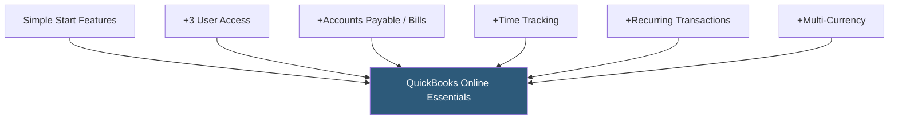

**Category:** Accounting Software Platforms
**Difficulty:** Beginner
**Reading time:** 5 min read

---

QuickBooks Online Essentials is the mid-entry QBO plan supporting three users, accounts payable (bill management), and time tracking, making it suitable for small businesses that need a bookkeeper or accountant to have simultaneous access. It represents the most common starting plan for small businesses with more than one financial stakeholder.

- **Accounts payable (AP)** — the bill management module for recording vendor invoices, scheduling payment due dates, and tracking outstanding obligations
- **Three-user access** — Essentials allows up to three named users with role-based permissions, enabling owner, bookkeeper, and accountant simultaneous access
- **Time tracking** — built-in employee time entry linked to projects, enabling billable hours invoicing and payroll preparation
- **Recurring transactions** — automated invoice and bill creation on defined schedules, reducing manual entry for repeating charges
- **Bill payment scheduling** — tracking due dates for vendor bills and generating a cash flow view of upcoming payment obligations

Essentials retains the full Simple Start feature set and adds the bill management workflow. In the AP module, vendors are created with contact and payment terms data. Bills are entered (manually or via receipt capture), coded to expense accounts, and scheduled for payment. The bill aging report shows all outstanding payables by due date, and the accounts payable aging summary supports cash flow planning.

Time tracking integrates with the payroll module (QuickBooks Payroll, sold separately) to pull approved employee hours into payroll processing. Billable time tracked against customers and projects can be automatically added to the next invoice, eliminating manual timesheet transfer.

Multi-currency support in Essentials (available in some regions) lets businesses invoice in foreign currencies and automatically apply exchange rate conversions using live rates, with realized/unrealized gain/loss tracked in the ledger. This feature is important for businesses with international customers or vendors.

- Small retail business where the owner manages inventory and an external bookkeeper reconciles accounts monthly
- Service firm billing clients for time and expenses requiring time tracking linked to invoicing
- Business with 10–20 vendor accounts that needs AP aging reports and bill scheduling
- Growing startup adding a part-time bookkeeper to the QBO file for the first time

| Advantage | Disadvantage |
|-----------|--------------|
| Three-user access enables owner + bookkeeper + accountant simultaneous access | No inventory tracking; requires upgrade to Plus for basic COGS tracking |
| Bill management covers the full AP lifecycle | Project profitability reporting requires Plus plan |
| Time tracking links employee hours directly to invoicing and payroll | More expensive than Wave or Zoho Books for similar feature coverage |

- [QuickBooks Online Simple Start](quickbooks-online-simple-start.md)
- [QuickBooks Online Plus](quickbooks-online-plus.md)
- [FreshBooks Accounting Software](freshbooks-accounting-software.md)

---
*Part of the [Accounting Software Platforms](index.md) category · [Back to Master Index](../../index.md)*
