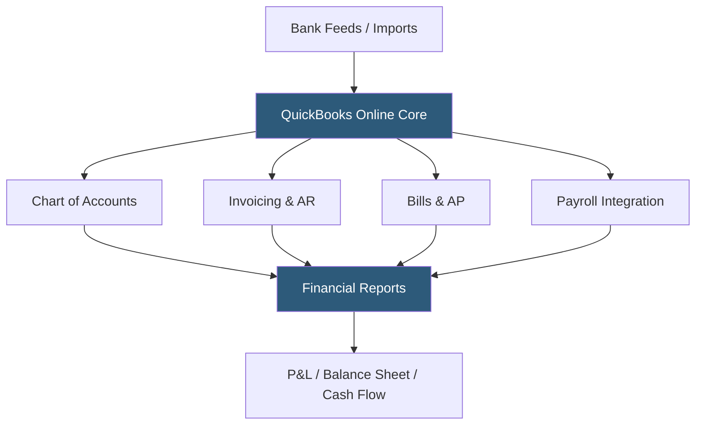

**Category:** Accounting Software Platforms
**Difficulty:** Beginner
**Reading time:** 6 min read

---

QuickBooks Online (QBO) is Intuit's cloud-based accounting platform serving over 8 million small and mid-sized businesses globally, providing double-entry bookkeeping, invoicing, payroll integration, and financial reporting through a browser-based interface. It matters as the dominant small business accounting platform in North America, with the largest ecosystem of accountant partners and third-party app integrations.

- **Double-entry bookkeeping** — every transaction creates matching debit and credit entries across two accounts, ensuring the balance sheet always balances
- **Chart of accounts** — the master list of all financial accounts (assets, liabilities, equity, income, expenses) that categorize every transaction in QBO
- **Bank feeds** — automatic import of bank and credit card transactions via direct connection to financial institutions, enabling automated reconciliation
- **Accrual vs cash basis** — QBO supports switching between accrual accounting (recognizing revenue/expenses when earned/incurred) and cash basis (when cash is received/paid) for reporting
- **QuickBooks App Store** — the ecosystem of 750+ third-party integrations including CRM, e-commerce, payroll, and industry-specific applications

QuickBooks Online is built on a multi-tenant SaaS architecture hosted on Intuit's cloud infrastructure. All data is stored in Intuit's servers and accessed via browser or mobile app. The platform's bank feed feature uses the same direct-connect protocols as Intuit's broader financial ecosystem, pulling transactions from over 14,000 financial institutions through FI direct connections and aggregator services.

The accounting engine enforces double-entry principles automatically — when an invoice is created and payment received, QBO creates the revenue credit, accounts receivable debit, cash receipt debit, and AR reduction credit without requiring manual journal entries. Users categorize imported bank transactions by selecting accounts, and QBO learns patterns over time to suggest categories automatically.

QBO's API (Intuit Developer Platform) exposes REST endpoints for all accounting objects — invoices, customers, vendors, transactions, and reports. Third-party apps authenticate via OAuth 2.0 and use the API to sync data bidirectionally. The platform processes over 1 billion API calls per month from the developer ecosystem. Reports (P&L, balance sheet, aged receivables, cash flow) are generated in real time from the underlying transaction data.

- Small business owner managing invoicing, expense tracking, and tax preparation in a single platform
- Bookkeeper managing 50+ client files simultaneously using the QuickBooks Online Accountant interface
- E-commerce business syncing Shopify orders and inventory to QBO via the official Shopify connector
- Growing company using QBO Advanced for custom reporting and workflow automation

| Advantage | Disadvantage |
|-----------|--------------|
| Largest accountant and bookkeeper ecosystem in North America | Pricing has increased significantly; can be expensive for very small businesses |
| 750+ app integrations covering most business categories | Customer support quality is inconsistent; complex issues can be slow to resolve |
| Automatic bank feeds and AI categorization reduce manual entry | Inventory management is limited compared to dedicated platforms |

- [QuickBooks Online Advanced](quickbooks-online-advanced.md)
- [Xero Accounting Platform](xero-accounting-platform.md)
- [Wave Accounting Platform](wave-accounting-platform.md)

---
*Part of the [Accounting Software Platforms](index.md) category · [Back to Master Index](../../index.md)*
