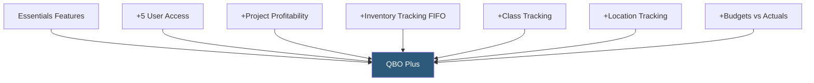

**Category:** Accounting Software Platforms
**Difficulty:** Intermediate
**Reading time:** 5 min read

---

QuickBooks Online Plus is the most popular QBO subscription tier, supporting five users and adding project profitability tracking, inventory management, and class/location tracking — features that are essential once businesses need departmental reporting or product-based revenue tracking. It is the recommended plan for product-based businesses and service firms managing multiple revenue streams.

- **Project profitability** — tracking all income (invoices) and expenses (bills, time, purchases) against a specific project to calculate net profit per engagement
- **Inventory tracking** — first-in, first-out (FIFO) inventory valuation that adjusts cost of goods sold as products are sold, updating stock levels automatically
- **Class tracking** — a reporting dimension for categorizing transactions by business unit, department, or segment without creating duplicate accounts
- **Location tracking** — a second reporting dimension for segmenting financial data by physical location, store, or geographic territory
- **Budget vs actuals** — the ability to create annual budgets per account and compare against actual spending in reports

Plus adds FIFO inventory management to the QBO engine. When products are received, QBO records the purchase cost and quantity. As products are sold on invoices, QBO automatically calculates COGS using the FIFO method — first units purchased are the first units expensed. The inventory valuation report shows current on-hand quantity and cost basis, and low-stock alerts notify when items fall below reorder points.

Class and location tracking add two additional columns to every transaction line item. These dimensions persist through to all reports — enabling a profit and loss report filtered by class (e.g., showing P&L for the "Marketing" department only) or by location (showing performance of the "San Francisco" store). Class and location data is also available in custom reports and exports.

Project profitability combines all project-linked transactions into a project summary showing revenue, direct costs (time, expenses), and profit margin. Each project is linked to a customer, and project budgets can be set to generate over/under-budget alerts. This feature replaces the need for manual spreadsheet project tracking for small service businesses.

- Small retailer tracking inventory across two physical store locations with location-based P&L reporting
- Marketing agency tracking project profitability across client retainers and one-off projects
- Multi-division business using class tracking to produce separate P&L reports for each product line
- Business with seasonal inventory needing FIFO cost tracking for tax reporting

| Advantage | Disadvantage |
|-----------|--------------|
| Inventory FIFO tracking eliminates manual COGS calculation | Inventory tracking is basic; not suitable for complex manufacturing or multi-warehouse operations |
| Class and location tracking enable departmental P&L without multiple company files | Five-user limit may be restrictive for growing teams |
| Project profitability replaces manual project spreadsheets | Upgrade to Advanced required for batch invoicing, custom user roles, and advanced reporting |

- [QuickBooks Online Essentials](quickbooks-online-essentials.md)
- [QuickBooks Online Advanced](quickbooks-online-advanced.md)
- [Xero Accounting Platform](xero-accounting-platform.md)

---
*Part of the [Accounting Software Platforms](index.md) category · [Back to Master Index](../../index.md)*
