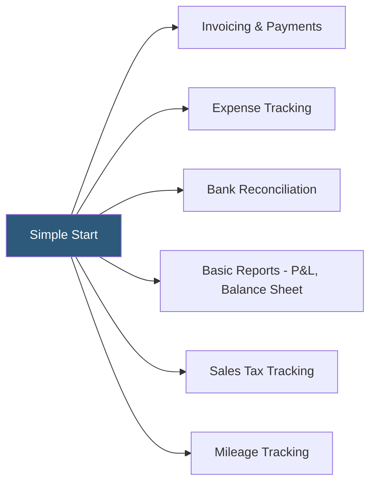

**Category:** Accounting Software Platforms
**Difficulty:** Beginner
**Reading time:** 5 min read

---

QuickBooks Online Simple Start is the entry-level QBO plan designed for sole proprietors and single-user businesses, providing basic income/expense tracking, invoicing, and tax reporting without the multi-user access or advanced features of higher tiers. It matters as the lowest-cost entry point into the QuickBooks ecosystem for new business owners.

- **Single-user access** — Simple Start allows only one concurrent user, making it unsuitable for businesses with separate bookkeepers or accountants needing simultaneous access
- **Income/expense tracking** — categorizing bank transactions against the chart of accounts to produce basic financial reports
- **Invoice creation** — creating and sending customer invoices with payment links; QBO Payments integration enables online payment collection
- **Tax summary report** — a year-end report grouping expenses by tax category to simplify Schedule C preparation for sole proprietors
- **Mileage tracking** — the built-in GPS mileage log in the QBO mobile app for tracking deductible business miles

Simple Start provides the core QBO accounting engine — bank feeds, chart of accounts, double-entry bookkeeping — limited to a single user login and a reduced feature set. The subscription includes connection to one bank or credit card account for automatic transaction import. Users create invoices, record expenses, reconcile accounts, and generate basic financial reports.

Key limitations relative to higher QBO tiers: no bill management (accounts payable), no time tracking, no inventory management, and no 1099 contractor management. These restrictions make Simple Start genuinely suitable only for very small service businesses where the owner handles all financial tasks alone. The plan costs approximately $30/month (billed monthly) or less on promotional pricing.

The accountant access feature allows a single authorized accounting firm to view the file at no additional cost, separate from the owner's user seat. However, the accountant cannot be a simultaneous user — they need the owner to be logged out first. This limitation is a common reason for upgrading to the Essentials plan.

- Freelance consultant invoicing 5–10 clients per month and tracking expenses for tax purposes
- Side business owner who handles all financial tasks personally and needs annual P&L for taxes
- New business owner learning double-entry accounting before upgrading to a higher plan
- Sole proprietor using mileage tracking and expense categorization as the primary accounting function

| Advantage | Disadvantage |
|-----------|--------------|
| Lowest-cost entry point into QBO ecosystem | Single-user restriction creates friction with bookkeepers and accountants |
| Full QBO accounting engine with bank feeds and real-time reports | No bill management, contractor 1099s, or inventory tracking |
| Upgrade path to higher tiers preserves all existing data | Price-to-value ratio poor compared to free alternatives like Wave for basic needs |

- [QuickBooks Online Platform](quickbooks-online-platform.md)
- [QuickBooks Online Essentials](quickbooks-online-essentials.md)
- [Wave Accounting Platform](wave-accounting-platform.md)

---
*Part of the [Accounting Software Platforms](index.md) category · [Back to Master Index](../../index.md)*
