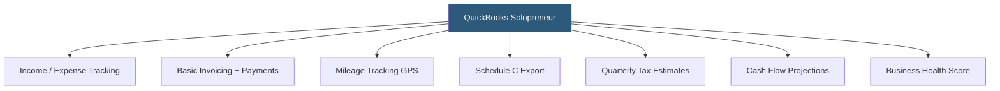

**Category:** Accounting Software Platforms
**Difficulty:** Beginner
**Reading time:** 5 min read

---

QuickBooks Solopreneur is Intuit's 2024 replacement for QuickBooks Self-Employed, designed for one-person businesses with simple income and expense needs, offering upgraded features including profit tracking, basic invoicing, and improved cash flow visibility while retaining the tax-focused mileage and Schedule C export capabilities of its predecessor.

- **Profit tracking** — a simplified P&L view showing income, expenses, and net profit for the current and prior periods without full double-entry accounting
- **Basic invoicing** — the ability to create and send simple invoices with payment links, addressing a key gap in Self-Employed that required workarounds
- **Cash flow projections** — a forward-looking view estimating upcoming income and expenses based on recurring transactions and scheduled payments
- **Business health score** — an Intuit-generated score summarizing financial health indicators like profit margin, cash flow trend, and expense ratio
- **Subscription transition** — existing Self-Employed subscribers are being migrated to Solopreneur pricing; new subscribers go directly to Solopreneur

Solopreneur uses the same bank feed infrastructure as other QBO products, connecting to financial institutions for automatic transaction import. The expense categorization workflow mirrors Self-Employed's swipe-left/right interface but adds the ability to split transactions and apply subcategories within Schedule C line items for more precise tax tracking.

The invoicing module in Solopreneur is lighter than QBO Simple Start — it creates and sends invoices and accepts online payment via QBO Payments (Intuit's payment processing service) but lacks recurring invoice scheduling, customer statements, and invoice customization options available in full QBO plans. For many freelancers who currently create invoices in Word or Google Docs, even this basic invoicing capability represents a meaningful improvement.

Cash flow projections use historical recurring transaction patterns to estimate the next 30 days of income and expenses, giving sole proprietors visibility into whether they will have sufficient cash to cover anticipated bills. This feature addresses a common pain point for freelancers with irregular income timing.

Solopreneur explicitly does not support employees, inventory, accounts payable, project tracking, or double-entry accounting. It remains strictly a simplified financial management tool for single-person businesses, positioned below Simple Start in the QBO product hierarchy.

- Consultant who needs basic invoicing and tax expense tracking without learning accounting principles
- Gig economy worker upgrading from Self-Employed to gain invoicing capability
- Freelancer using cash flow projections to plan quarterly estimated tax payments
- Sole proprietor wanting a comprehensive mobile app for both mileage and income tracking

| Advantage | Disadvantage |
|-----------|--------------|
| Adds invoicing to the Self-Employed feature set, addressing a major gap | Not a real accounting system; cannot support any complexity beyond one-person operations |
| Cash flow projections help freelancers with irregular income plan tax payments | Pricing similar to Simple Start, which offers full accounting for business growth |
| Simple onboarding with no accounting knowledge required | Migration from Self-Employed to Solopreneur involves data conversion complexities |

- [QuickBooks Self-Employed](quickbooks-self-employed.md)
- [QuickBooks Online Simple Start](quickbooks-online-simple-start.md)
- [Wave Accounting Platform](wave-accounting-platform.md)

---
*Part of the [Accounting Software Platforms](index.md) category · [Back to Master Index](../../index.md)*
