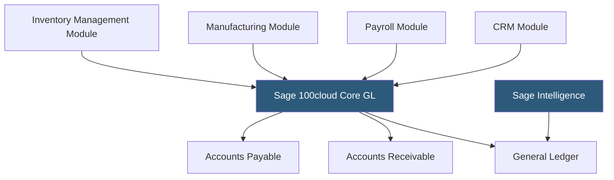

**Category:** Accounting Software Platforms
**Difficulty:** Advanced
**Reading time:** 5 min read

---

Sage 100cloud is a mid-market ERP and accounting platform for distribution, manufacturing, and services companies, offering advanced inventory management, production management, and financial reporting with a cloud-connected architecture. It targets businesses with $5M–$100M in revenue that need more capability than SMB accounting tools but less complexity than Oracle or SAP.

- **ERP modules** — Sage 100cloud is modular; businesses license accounting core plus optional modules (inventory, manufacturing, payroll, CRM) based on operational needs
- **Advanced inventory management** — multiple warehouses, bin locations, lot/serial tracking, returns management, and reorder point automation
- **Production management** — bill of materials, work orders, and manufacturing cost tracking for light manufacturing operations
- **Sage Intelligence** — the built-in reporting and analytics tool for creating custom financial reports and dashboards using Excel
- **Business Framework** — Sage 100cloud's underlying platform layer managing security, user roles, and customization through a scripting environment

Sage 100cloud runs primarily on-premises as a Windows client-server application, with cloud connectivity via the Sage Cloud Connector for remote access and data synchronization with cloud services. The modular architecture allows businesses to activate only required modules, controlling costs. Each module adds its own processing capabilities — inventory management adds multi-location stock control, manufacturing adds work orders and labor cost tracking, payroll adds wage processing and tax filing.

Inventory management supports advanced operations: lot and serial number tracking from purchase receipt through sale, bin location management within warehouses, multiple units of measure per item, and returns merchandise authorization (RMA) workflows. These capabilities support distribution operations that handle regulated products, electronics, or consumer goods requiring traceability.

Sage Intelligence connects to Sage 100cloud's database and enables users to build custom reports using Excel as the report designer. Financial reports, KPI dashboards, and operational reports are published to a reporting portal accessible by non-Sage users. This Excel-based approach is familiar to finance teams without BI tool expertise.

- Wholesale distributor tracking 50,000 SKUs across 3 warehouses with lot tracking and RMA workflows
- Light manufacturer processing work orders, tracking labor costs, and calculating production variances
- Distribution business needing advanced pricing matrices with customer-specific and volume-break pricing rules
- Mid-market company requiring Sage 100cloud's deep customization capability via Business Framework scripting

| Advantage | Disadvantage |
|-----------|--------------|
| Modular architecture allows paying only for required functionality | On-premises primary architecture requires local IT infrastructure |
| Advanced inventory and distribution capabilities exceed QBO/Xero significantly | Implementation complexity and cost substantially higher than SMB accounting tools |
| Sage Intelligence Excel-based reporting familiar to finance teams | Smaller developer/integration ecosystem than Dynamics 365 or NetSuite |

- [Sage Intacct Cloud Financials](sage-intacct-cloud-financials.md)
- [Sage 300cloud](sage-300cloud.md)
- [NetSuite ERP Financials](netsuite-erp-financials.md)

---
*Part of the [Accounting Software Platforms](index.md) category · [Back to Master Index](../../index.md)*
