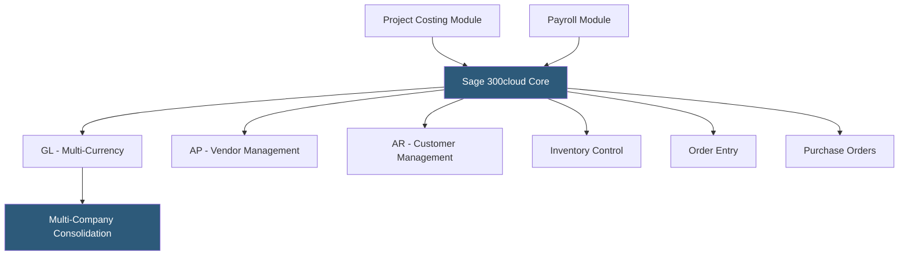

**Category:** Accounting Software Platforms
**Difficulty:** Advanced
**Reading time:** 5 min read

---

Sage 300cloud (formerly ACCPAC) is Sage's mid-to-upper-market ERP platform supporting multi-currency, multi-company, and multi-language environments, targeting international businesses and organizations with complex intercompany transactions. It is particularly prevalent in Canada, Southeast Asia, the Middle East, and Africa where Sage has strong regional presence.

- **Multi-currency processing** — full multi-currency support with functional and reporting currencies, revaluation, and exchange gain/loss tracking at the transaction level
- **Multi-company consolidation** — consolidated reporting across multiple legal entities with intercompany payables/receivables netting
- **Project and job costing** — detailed project accounting with phase and category cost tracking, billing, and profitability reporting
- **Sage Payment Solutions** — integrated payment processing for AR collections and AP disbursements via bank file generation
- **SDK and customization** — Sage 300cloud offers a development SDK enabling partner and in-house customization through VBA-based scripting and external API connections

Sage 300cloud's general ledger supports a functional currency (home currency), a reporting currency (e.g., USD for a Canadian company reporting to US parent), and transaction currencies for any foreign currency transaction. Exchange rates are maintained in a rate table, and the system calculates all currency conversions at transaction time using the applicable rate.

Multi-company processing in Sage 300cloud allows a single installation to manage multiple legal entities with separate charts of accounts, fiscal year settings, and currency configurations. Intercompany transactions (loans, shared services, management fees) generate corresponding entries in both entities automatically, and consolidation reports aggregate financials with elimination of intercompany balances.

The platform uses a web-screen architecture that can run in a web browser or as a traditional Windows client, with the web interface supported for most operational modules. Sage 300cloud's SDK has a decades-long history of partner extensions, meaning there are mature third-party modules for vertical industries (construction, distribution, professional services) built on the platform.

- Canadian subsidiary of a US company maintaining books in CAD while reporting in USD to the parent
- International business managing entities in 5 countries with different currencies from a single Sage 300cloud installation
- Regional distributor in Southeast Asia using the platform's strong APAC market presence and local tax compliance
- Services company with complex project billing needing detailed phase and category cost tracking

| Advantage | Disadvantage |
|-----------|--------------|
| Best-in-class multi-currency and multi-company handling for international organizations | Older interface design less modern than cloud-native platforms |
| Strong regional support and partner ecosystem in Canada, APAC, MENA | Implementation requires specialized Sage 300 partners; in-house implementation risky |
| Long-established SDK with mature vertical add-ons available | Cloud access is an add-on to a fundamentally on-premises architecture |

- [Sage 100cloud](sage-100cloud.md)
- [Sage Intacct Cloud Financials](sage-intacct-cloud-financials.md)
- [NetSuite ERP Financials](netsuite-erp-financials.md)

---
*Part of the [Accounting Software Platforms](index.md) category · [Back to Master Index](../../index.md)*
