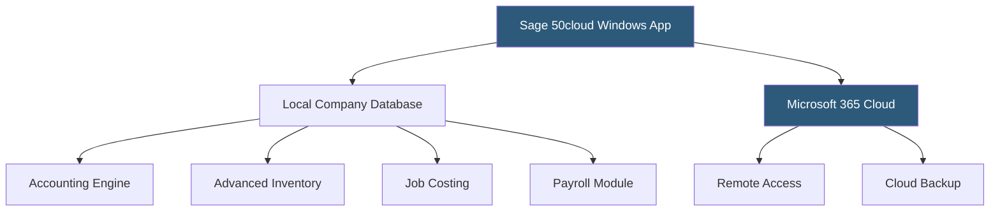

**Category:** Accounting Software Platforms
**Difficulty:** Intermediate
**Reading time:** 5 min read

---

Sage 50cloud (formerly Peachtree) is a hybrid desktop/cloud accounting platform combining Windows-based local processing with optional Microsoft 365 integration for remote access, advanced inventory management, and job costing capabilities suited to small and mid-size businesses in manufacturing, distribution, and construction.

- **Hybrid architecture** — Sage 50cloud runs as a Windows desktop application with cloud backup and remote access via Microsoft 365 integration
- **Advanced inventory** — multi-location inventory tracking with FIFO, LIFO, and specific identification costing methods
- **Job costing** — phase-level cost tracking for construction and project-based businesses with estimated vs actual reporting
- **Microsoft 365 integration** — cloud backup, remote access through a Microsoft-hosted environment, and Excel report integration
- **Sage 50cloud Payroll** — a fully integrated payroll module processing payroll for US and Canadian employees with tax filing support

Sage 50cloud's core engine runs locally on Windows, providing the performance benefits of native application processing for large transaction databases. The Microsoft 365 integration adds a cloud layer: company files can be backed up automatically to OneDrive, and remote access is available through a web browser via the Sage 50cloud web sync or Microsoft Remote Desktop.

Inventory management in Sage 50cloud supports three costing methods — FIFO, LIFO, and specific identification — which QBO and Xero do not offer. Multi-location inventory tracks stock at multiple warehouses independently. Assembly items define finished goods as bills of materials, and the system tracks raw material consumption as assemblies are built.

Job costing provides detailed phase-level cost tracking with estimated vs actual comparisons. Change orders, retainage, and AIA billing formats are supported for construction applications, making Sage 50cloud a common choice in the construction industry alongside QuickBooks Desktop Premier.

- US manufacturer needing LIFO inventory costing for tax optimization purposes
- Construction company requiring AIA billing format and retainage tracking
- Distributor with multiple warehouses tracking inventory at each location independently
- Business with both payroll and accounting needing fully integrated payroll without third-party add-ons

| Advantage | Disadvantage |
|-----------|--------------|
| LIFO costing method available — not offered by QBO or Xero | Desktop-first architecture requires Windows and local IT management |
| Integrated payroll covers US and Canada without external payroll service | Microsoft 365 integration for remote access adds subscription cost |
| Strong construction and manufacturing capabilities | Fewer cloud-native integrations than QBO or Xero ecosystems |

- [Sage Business Cloud Accounting](sage-business-cloud-accounting.md)
- [Sage Intacct Cloud Financials](sage-intacct-cloud-financials.md)
- [QuickBooks Desktop Pro](quickbooks-desktop-pro.md)

---
*Part of the [Accounting Software Platforms](index.md) category · [Back to Master Index](../../index.md)*
