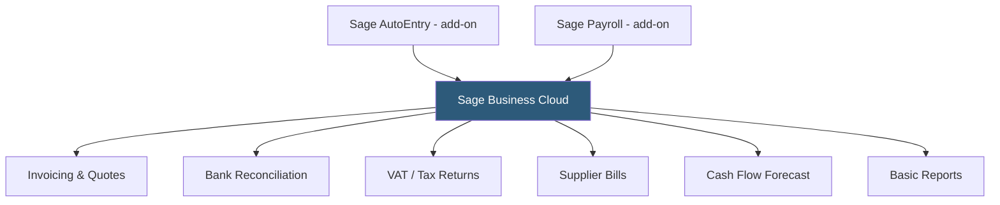

**Category:** Accounting Software Platforms
**Difficulty:** Intermediate
**Reading time:** 5 min read

---

Sage Business Cloud Accounting (formerly Sage One) is Sage's entry-level cloud platform for small businesses in the UK, US, Canada, South Africa, and other markets, providing invoicing, bank reconciliation, VAT/tax compliance, and basic reporting through a browser-based interface. It represents Sage's SMB cloud offering positioned below Sage Intacct's enterprise capabilities.

- **MTD (Making Tax Digital)** — UK-specific VAT return submission integrated directly into Sage Business Cloud for HMRC compliance
- **Multi-currency** — support for transactions in multiple currencies with automatic exchange rate updates
- **Automated bank feeds** — direct bank connections covering Barclays, Lloyds, NatWest, and other major UK banks for automatic transaction import
- **Sage AutoEntry** — an OCR-based document capture add-on for digitizing invoices and receipts from email or physical documents
- **Accountant access** — separate accountant login with advisory tools for accountants managing multiple Sage client files

Sage Business Cloud uses a double-entry accounting engine with a pre-configured chart of accounts aligned to UK/US accounting conventions. The VAT module calculates output and input VAT on transactions and generates a VAT return summary for the reporting period. For UK businesses, the MTD integration submits the VAT return directly to HMRC via the government's MTD API, eliminating manual submission through the HMRC portal.

Bank feeds connect to UK banks via Open Banking (PSD2) APIs for direct, account-holder-authorized connections — a more secure approach than credential-based aggregation. Transaction import updates automatically, and reconciliation presents bank statement items alongside matching Sage records.

Cash flow forecasting uses scheduled invoices and bills to project 30/60/90-day cash position, displaying a bar chart of projected inflows and outflows. This forward-looking view helps business owners anticipate cash shortfalls before they occur.

- UK small business submitting VAT returns directly to HMRC via MTD integration
- South African SMB using Sage's strong regional presence and local tax compliance
- Business wanting cash flow forecasting to plan payments and collections proactively
- Accountant managing multiple UK small business clients from a single Sage accountant dashboard

| Advantage | Disadvantage |
|-----------|--------------|
| Strong UK/Commonwealth market presence with deep local tax compliance | Smaller app integration ecosystem than QBO or Xero globally |
| Open Banking direct connections more secure than credential-based bank feeds | Less intuitive interface than FreshBooks or QBO for non-accountant users |
| MTD VAT submission built in, eliminating third-party bridging software | Sage's pricing can be higher than QBO equivalents for comparable feature tiers |

- [Sage 50cloud Accounting](sage-50cloud-accounting.md)
- [Sage Intacct Cloud Financials](sage-intacct-cloud-financials.md)
- [Xero Accounting Platform](xero-accounting-platform.md)

---
*Part of the [Accounting Software Platforms](index.md) category · [Back to Master Index](../../index.md)*
