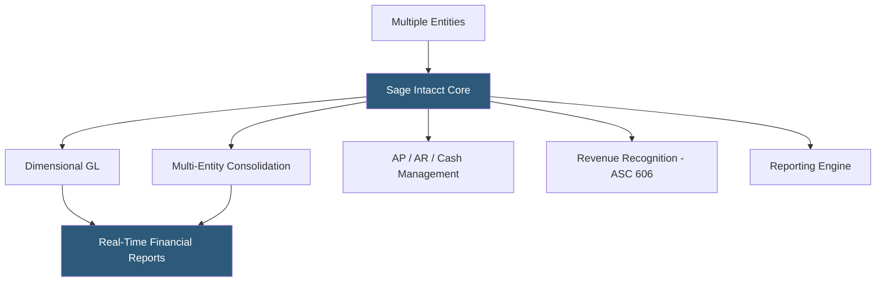

**Category:** Accounting Software Platforms
**Difficulty:** Advanced
**Reading time:** 6 min read

---

Sage Intacct is an AICPA-preferred cloud financial management platform targeting mid-market organizations, providing multi-entity consolidation, dimensional accounting, real-time financial reporting, and deep integration capabilities for non-profits, professional services, SaaS companies, and healthcare organizations. It matters as the accounting system of record for companies that have outgrown QBO or Xero but do not require the full complexity of Oracle or SAP.

- **Dimensional accounting** — transactions tagged with multiple custom dimensions (department, project, location, fund) enabling any-dimension financial analysis without multiple entities
- **Multi-entity management** — consolidated financial reporting across multiple legal entities with automatic intercompany eliminations
- **AICPA preferred** — Sage Intacct is the only accounting software endorsed by the American Institute of Certified Public Accountants as a preferred provider
- **Real-time consolidation** — subsidiary financials consolidate to parent company reports without end-of-period close batch processes
- **Sage Intacct Marketplace** — 350+ pre-built integrations with CRM, HR, payroll, and industry-specific applications

Sage Intacct's general ledger is built around a dimensional tagging model. Every transaction line item can carry values for up to 10 custom dimensions defined by the organization — department, project, grant, program, location, customer, product line, etc. These dimensions are stored natively in the GL rather than as cost center codes, enabling filtering and grouping of any financial report by any dimension combination without chart of accounts proliferation.

Multi-entity accounting handles separate legal entities in a single Intacct subscription. Each entity has its own chart of accounts, currency, and tax rules, but consolidation reports aggregate all entities with automatic intercompany elimination of intracompany transactions. Shared services allocations post charges from parent to subsidiary entities via allocation schedules.

Revenue recognition in Sage Intacct automates ASC 606 and IFRS 15 compliance through a revenue contract management module. Service contracts create deferred revenue schedules that automatically recognize revenue based on contract terms — straight-line, usage-based, or milestone triggers — posting entries without manual journal entries each period.

- Non-profit with 15 programs needing fund accounting, grant tracking, and FASB reporting with dimensional analysis
- SaaS company managing multi-year subscription contracts with automated ASC 606 revenue recognition
- Private equity portfolio company reporting to investors with consolidated multi-entity financials
- Healthcare organization with 8 clinic entities needing real-time consolidation and departmental P&L reporting

| Advantage | Disadvantage |
|-----------|--------------|
| Dimensional GL eliminates chart of accounts proliferation for complex organizations | Implementation cost and time significantly higher than SMB accounting platforms |
| Real-time multi-entity consolidation without batch close processes | Pricing model scales with users and modules; can reach $10,000+/year for mid-market deployments |
| AICPA endorsement provides audit-readiness credibility | Steeper learning curve; benefits require proper implementation and configuration |

- [NetSuite ERP Financials](netsuite-erp-financials.md)
- [Sage 50cloud Accounting](sage-50cloud-accounting.md)
- [Microsoft Dynamics 365 Business Central](microsoft-dynamics-365-business-central.md)

---
*Part of the [Accounting Software Platforms](index.md) category · [Back to Master Index](../../index.md)*
