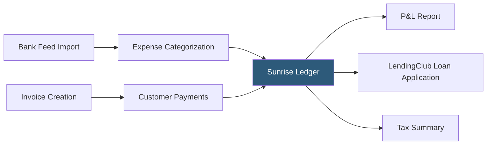

**Category:** Accounting Software Platforms
**Difficulty:** Beginner
**Reading time:** 4 min read

---

Sunrise (formerly Billy) is a free cloud accounting platform acquired by LendingClub targeting freelancers and small businesses, offering invoicing, expense tracking, and basic reporting. Its unique positioning combines free accounting software with access to LendingClub's business financing products, making financial statements available to lenders without separate document preparation.

- **Free tier** — Sunrise's core accounting features (invoicing, expense tracking, bank feeds, and basic reports) are available at no cost with unlimited customers and invoices
- **Bookkeeping services** — paid add-on where Sunrise connects users with dedicated bookkeepers who manage categorization and monthly reconciliation
- **LendingClub integration** — Sunrise financial data feeds directly into LendingClub business loan applications, reducing documentation friction for borrowers
- **Profit and loss statement** — real-time P&L generated from categorized income and expenses, a primary output used for tax preparation and loan applications
- **Customer portal** — online payment portal where customers pay invoices via ACH or card, with automatic reconciliation to the Sunrise ledger

Sunrise connects to bank accounts and credit cards through bank feeds, importing transactions automatically. Users categorize transactions as income or expense categories aligned with standard tax schedules (Schedule C categories for sole proprietors). The platform builds a monthly P&L from confirmed categorizations in real time.

Invoicing supports customizable templates with business logo and payment terms. Customers receive email invoices with a payment link; paid invoices are matched to incoming bank transactions automatically. Recurring invoices can be scheduled for subscription-based client billing.

The bookkeeping add-on pairs users with a dedicated bookkeeper who handles monthly categorization review, reconciliation, and financial report preparation. The bookkeeper communicates through the Sunrise platform and flags transactions requiring user input.

Sunrise's LendingClub connection is the product's most distinctive feature: when applying for a business loan through LendingClub, Sunrise users can authorize direct data sharing, providing lenders with real-time financial data instead of manually uploaded statements.

- Sole proprietor needing free invoicing and expense tracking without a monthly software subscription
- Freelancer wanting a simple P&L for tax preparation without hiring a bookkeeper
- Small business owner applying for a LendingClub business line of credit and using Sunrise to provide financial data
- Early-stage business using the free tier until revenue justifies a paid accounting solution

| Advantage | Disadvantage |
|-----------|--------------|
| Genuinely free core features with no transaction or invoice limits | Limited features compared to Wave or ZipBooks at the same price point |
| LendingClub integration streamlines business loan applications | Platform direction tied to LendingClub's strategic priorities; uncertain long-term roadmap |
| Bookkeeping add-on provides professional support without a separate vendor | No inventory management, payroll, or project tracking capabilities |

- [Wave Free Accounting Software](wave-free-accounting-software.md)
- [Kashoo Cloud Accounting](kashoo-cloud-accounting.md)
- [ZipBooks Accounting Software](zipbooks-accounting-software.md)

---
*Part of the [Accounting Software Platforms](index.md) category · [Back to Master Index](../../index.md)*
