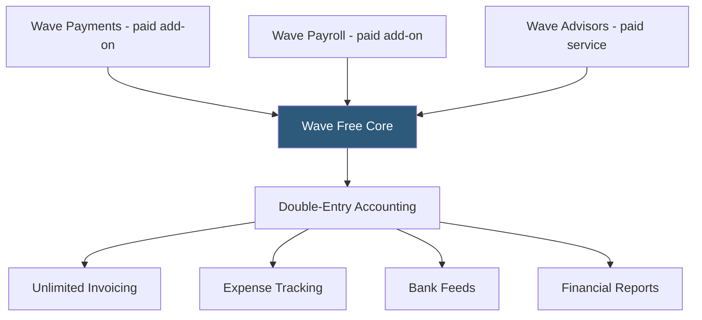

**Category:** Accounting Software Platforms
**Difficulty:** Beginner
**Reading time:** 6 min read

---

Wave is a free cloud accounting platform for small businesses and freelancers providing double-entry bookkeeping, unlimited invoicing, and expense tracking at no cost, monetizing through payment processing and payroll add-on fees rather than subscription charges. It matters as the most capable free accounting solution for very small businesses that cannot justify paid platforms.

- **Free core accounting** — Wave's accounting, invoicing, and receipt scanning are permanently free with no client or transaction limits
- **Monetization via add-ons** — Wave generates revenue through Wave Payments (credit card processing), Wave Payroll, and Wave Advisors (bookkeeping services)
- **Double-entry accounting** — Wave uses a proper double-entry accounting engine, producing accurate balance sheets and P&L statements despite the free tier
- **Wave Payments** — the integrated payment processor allowing clients to pay invoices online via credit card (2.9% + $0.60) or ACH bank transfer (1% per transaction)
- **Wave Advisors** — a subscription service pairing Wave users with professional bookkeepers, similar to QuickBooks Live Bookkeeping

Wave's accounting engine is a full double-entry system built on the same conceptual foundation as QBO and Xero. Transactions create dual-sided journal entries, the chart of accounts follows standard accounting structure (assets, liabilities, equity, income, expenses), and reports include P&L, balance sheet, cash flow statement, and trial balance.

Bank connections import transactions via Plaid's aggregation network, covering most North American financial institutions. Imported transactions are categorized using Wave's rule engine and machine learning suggestions. The reconciliation workflow presents bank statement balances alongside Wave's calculated balance, flagging discrepancies.

The free model is sustainable because payment processing fees generate revenue whenever a client pays an invoice via Wave Payments. Businesses that invoice frequently and collect payments online effectively pay Wave through transaction fees rather than a monthly subscription. Wave's business model aligns its interests with client invoice collection success.

Wave was acquired by H&R Block in 2019, which expanded the Advisors bookkeeping service and payroll offering. The core free accounting product has been maintained.

- Freelancer with minimal revenue who cannot justify even a $15/month accounting subscription
- Side business owner needing basic invoicing, expense tracking, and annual P&L for taxes at zero cost
- Non-profit with a small budget needing proper double-entry accounting without software expense
- New business validating revenue model before committing to paid accounting software

| Advantage | Disadvantage |
|-----------|--------------|
| Genuinely free with no artificial limitations on invoicing or clients | Payment processing rates slightly higher than Stripe direct (2.9% + $0.60 vs $0.30) |
| Proper double-entry accounting, not a simplified single-entry system | Customer support is limited for free users; paid support requires Wave Advisors |
| No contract or subscription commitment | Fewer integrations than QBO or Xero; no app store ecosystem |

- [Wave Free Accounting Software](wave-free-accounting-software.md)
- [Wave Invoicing](wave-invoicing.md)
- [QuickBooks Online Simple Start](quickbooks-online-simple-start.md)

---
*Part of the [Accounting Software Platforms](index.md) category · [Back to Master Index](../../index.md)*
