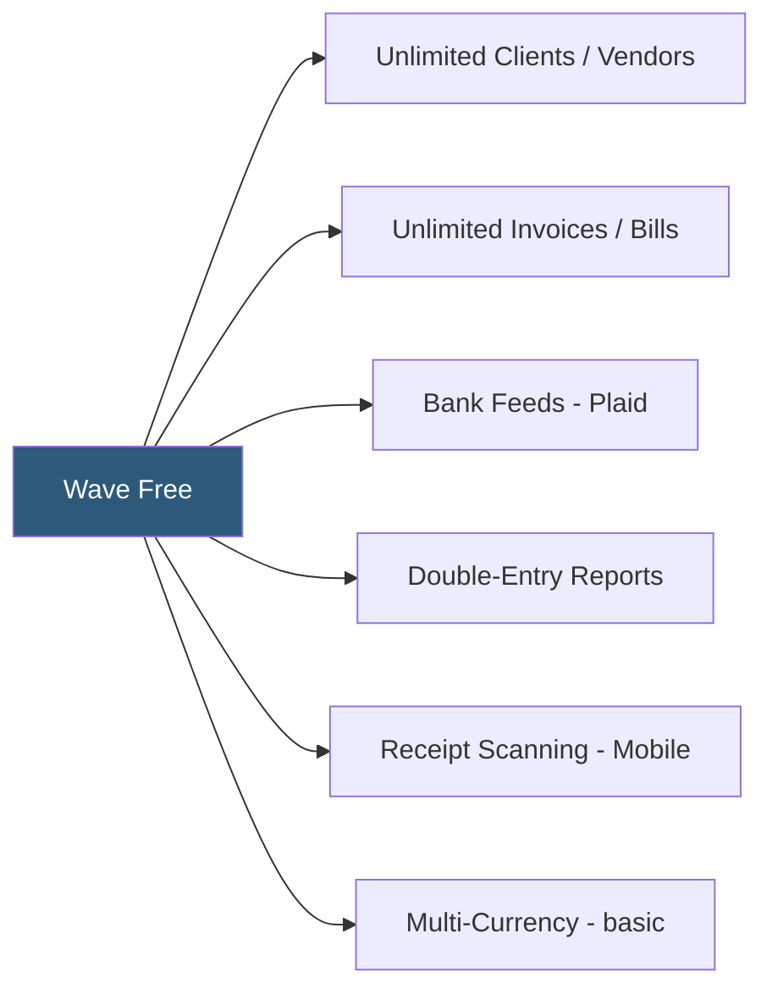

**Category:** Accounting Software Platforms
**Difficulty:** Beginner
**Reading time:** 5 min read

---

Wave's free accounting tier provides unlimited double-entry bookkeeping, invoicing, expense tracking, and financial reporting with no subscription fee, client limits, or invoice caps. It is the defining characteristic of Wave as a platform and the primary reason small businesses choose it over paid alternatives.

- **Permanently free** — Wave's core accounting features are not a limited trial but a permanent free offering with no subscription expiration
- **No client limits** — unlimited customer and vendor records, unlike FreshBooks Lite's 5-client cap
- **No invoice limits** — unlimited invoices, estimates, bills, and transactions, unlike Xero Starter's 20-invoice monthly cap
- **Chart of accounts** — a pre-configured default chart of accounts that users can customize, covering all standard business account categories
- **Reports** — standard financial reports (P&L, balance sheet, cash flow statement, AR aging, AP aging, trial balance) generated in real time at no cost

Wave's free tier is feature-complete for its intended use case. The accounting engine enforces double-entry principles: creating an invoice credits revenue and debits accounts receivable; recording a payment debits cash and credits AR; posting an expense credits cash or creates a liability in accounts payable. The chart of accounts can be customized with user-defined accounts, cost centers, and account numbering.

Bank feeds connect to financial institutions via Plaid, importing transactions automatically. Users categorize transactions by selecting from the chart of accounts, and Wave learns common categorizations to suggest them for future similar transactions. Bank reconciliation compares imported transactions against Wave's ledger and highlights unmatched items.

The free tier includes receipt scanning via the Wave mobile app using OCR technology to extract merchant, amount, and date. Extracted receipts are attached to expense records in the accounting module. Receipt scanning quality varies by image clarity.

The financial reports — P&L, balance sheet, cash flow statement — generate in real time from the transaction ledger. Export to Excel or PDF is available for sharing with accountants. Tax reports summarize income and expense by tax category for Schedule C preparation.

- Freelancer validating Wave's capabilities before deciding whether to invest in paid accounting software
- Very small business with under $100K revenue operating Wave as permanent accounting solution
- Nonprofit with no technology budget needing compliant financial reporting
- Side business tracking income and expenses for annual tax preparation without monthly software costs

| Advantage | Disadvantage |
|-----------|--------------|
| No cost whatsoever for core accounting functionality | No telephone or chat support for free users; only community forums |
| No artificial limits on clients, invoices, or users | Payroll, payment processing, and bookkeeping services are paid add-ons |
| Real double-entry accounting engine, not a simplified tool | Fewer bank connection options than QBO in some non-North American markets |

- [Wave Accounting Platform](wave-accounting-platform.md)
- [Wave Invoicing](wave-invoicing.md)
- [Akaunting Open-Source Accounting](akaunting-open-source-accounting.md)

---
*Part of the [Accounting Software Platforms](index.md) category · [Back to Master Index](../../index.md)*
