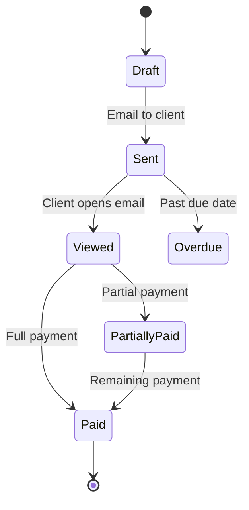

**Category:** Accounting Software Platforms
**Difficulty:** Beginner
**Reading time:** 5 min read

---

Wave Invoicing is the free invoice creation and delivery module within Wave Accounting, enabling businesses to create customized, professional invoices and send them to clients with online payment options. As a standalone feature within the free Wave platform, it provides a polished invoicing experience competitive with paid tools.

- **Invoice customization** — adjustable templates with business logo, color scheme, custom columns, notes, and payment terms
- **Online payment integration** — clients can pay invoices directly via an embedded payment button using Wave Payments (credit card or ACH bank transfer)
- **Recurring invoices** — optional automated recurring invoice creation and delivery on weekly, bi-weekly, monthly, or custom schedules
- **Payment reminders** — configurable automatic email reminders sent to clients before and after invoice due dates
- **Invoice status tracking** — real-time visibility into invoice states: draft, sent, viewed, partially paid, paid, overdue

Wave Invoicing generates HTML email invoices with a plain-text fallback, delivered via Wave's email infrastructure. Each invoice has a unique client-facing URL that opens a payment portal page showing invoice details and payment buttons. The portal is mobile-responsive and branded with the business's logo and color scheme.

When a client pays via Wave Payments, the funds are processed by Wave's payment infrastructure (powered by Stripe) and deposited to the business bank account in 2 business days for bank transfers or 2–3 days for card payments. The payment automatically marks the invoice as paid in Wave's accounting module and creates the corresponding journal entry (debit cash, credit accounts receivable).

Recurring invoice automation creates invoice drafts on the configured schedule — Wave can send these automatically or hold them for review. Reminder emails are configured in the client settings with customizable timing and message templates. Invoice viewed notifications (sent when the client opens the invoice email) provide delivery confirmation without requiring manual follow-up.

- Freelancer creating professionally branded invoices that accept credit card payment for faster collection
- Service business automating monthly recurring invoice delivery to subscription clients
- Consultant setting automatic 7-day and 30-day overdue payment reminder emails
- Small business owner tracking which clients have viewed their invoices but not yet paid

| Advantage | Disadvantage |
|-----------|--------------|
| Professional invoicing at zero cost with no client or invoice limits | Payment processing fees apply when clients pay online |
| Real-time payment and view status reduces manual follow-up calls | Fewer customization options than dedicated invoicing tools like Invoice Ninja |
| Automatic late payment reminders reduce collection burden | ACH payments take 2 business days longer than immediate payment |

- [Wave Accounting Platform](wave-accounting-platform.md)
- [Wave Receipts Scanning](wave-receipts-scanning.md)
- [FreshBooks Lite Plan](freshbooks-lite-plan.md)

---
*Part of the [Accounting Software Platforms](index.md) category · [Back to Master Index](../../index.md)*
