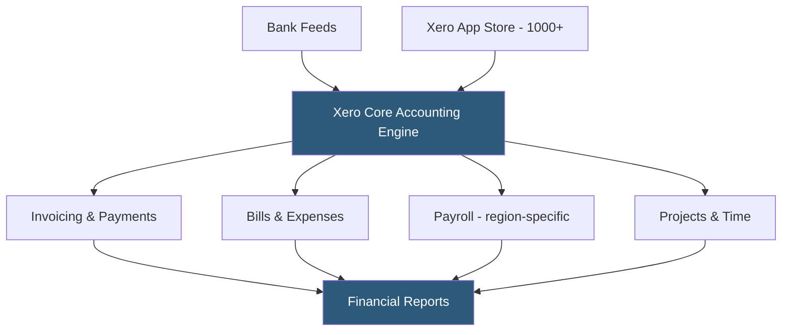

**Category:** Accounting Software Platforms
**Difficulty:** Intermediate
**Reading time:** 6 min read

---

Xero is a cloud-based accounting platform headquartered in New Zealand with 3.7+ million subscribers globally, particularly dominant in Australia, New Zealand, and the UK, offering unlimited users at all plan levels, a modern UI, and 1,000+ app integrations. It matters as the primary QBO competitor in English-speaking markets outside North America and a preferred platform for tech-forward accounting firms.

- **Unlimited users** — all Xero plans include unlimited user seats, a major differentiator versus QBO's per-tier user limits
- **Bank reconciliation** — Xero's core workflow presents bank statement lines alongside matching QBO transactions for one-click or rule-based reconciliation
- **Xero HQ** — the practice management platform for accounting firms managing multiple Xero client files from a single dashboard
- **Xero App Store** — 1,000+ third-party integrations across payroll, e-commerce, inventory, CRM, and industry-specific tools
- **Multi-currency** — all Xero plans support transactions in foreign currencies with automatic exchange rate updates

Xero's accounting engine is a double-entry system built natively on a cloud architecture (AWS) with real-time data sync across all connected users. The bank reconciliation interface displays imported bank transactions alongside suggested matches from Xero's transaction database. Xero applies reconciliation rules — user-defined conditions that automatically code recurring transactions to specific accounts — to reduce manual categorization.

Xero's open API is a REST API with OAuth 2.0 authentication that allows third-party applications to read and write all accounting objects. The API handles over 250 million requests per day across the app ecosystem. App partners build integrations covering industry verticals — restaurant point-of-sale systems, legal practice management, construction job costing — that push transaction data into Xero without manual re-entry.

The unlimited user model is architecturally enabled by Xero's permission system, which offers four default roles (Standard, Advisor, Read-Only, Invoice Only) and custom role templates. This allows businesses to give salespeople invoice-only access, warehouse staff purchase order access, and executives read-only financial reporting access without purchasing additional seats.

- Australian small business needing unlimited staff access to create invoices and approve expenses
- UK accountant managing 200 client files from Xero HQ with centralized practice management
- Tech startup preferring Xero's modern UI and REST API for custom integration with proprietary systems
- Multi-currency business invoicing customers in USD, EUR, GBP, and AUD from a single system

| Advantage | Disadvantage |
|-----------|--------------|
| Unlimited users at all plan levels eliminates per-user scaling costs | Smaller accountant ecosystem in North America compared to QBO |
| Modern REST API and developer documentation make integrations straightforward | Payroll is region-specific and requires third-party integration in many countries |
| Strong in AU/NZ/UK markets with local tax compliance built in | Customer support response times criticized for slower tier resolution |

- [Xero Starter Plan](xero-starter-plan.md)
- [QuickBooks Online Platform](quickbooks-online-platform.md)
- [FreshBooks Accounting Software](freshbooks-accounting-software.md)

---
*Part of the [Accounting Software Platforms](index.md) category · [Back to Master Index](../../index.md)*
