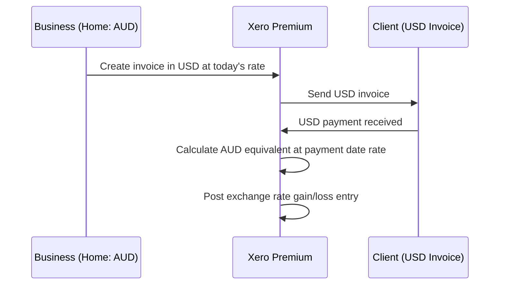

**Category:** Accounting Software Platforms
**Difficulty:** Intermediate
**Reading time:** 5 min read

---

Xero Premium adds full multi-currency support to the Standard plan's feature set, enabling businesses that transact in multiple foreign currencies to invoice, pay bills, and reconcile bank accounts in those currencies with automatic exchange rate handling. It is targeted at importers, exporters, and businesses with international customers or suppliers.

- **Multi-currency transactions** — the ability to create invoices and bills in any currency, with amounts converted to the home currency at the transaction date exchange rate
- **Foreign currency bank accounts** — Xero can connect to and reconcile bank accounts denominated in currencies other than the home currency
- **Exchange rate gain/loss** — the accounting treatment for the difference between the invoice exchange rate and the payment date exchange rate, automatically posted as a realized gain or loss
- **Currency revaluation** — the process of restating foreign currency balances at the current rate at period end to calculate unrealized exchange gains/losses
- **Xero to Xero** — a feature enabling connected Xero organizations to send invoices directly to each other's Xero accounts, useful for related-party transactions

When a multi-currency invoice is created in Premium, Xero fetches the current mid-market exchange rate from a live currency feed and converts the foreign currency amount to the home currency equivalent. This home currency amount is what appears on the P&L and balance sheet. When payment is received and the exchange rate has moved, Xero automatically calculates the difference and posts a realized exchange gain or loss to the designated currency gain/loss account.

Foreign currency bank accounts connect to the bank feed like domestic accounts. Reconciliation matches the bank's foreign currency transactions, and Xero handles the conversion. The unrealized gain/loss revaluation tool, run at period end, restates all open foreign currency balances at the current rate and posts the difference to an unrealized gain/loss account, which reverses in the following period.

Premium plan pricing is approximately 30–40% higher than Standard in most markets. For businesses with even one significant foreign customer or supplier, the accurate exchange rate accounting alone justifies the cost compared to managing foreign currency manually.

- Australian importer paying USD invoices to US suppliers with fluctuating exchange rates
- SaaS business invoicing European customers in EUR while reporting in GBP
- Nonprofit receiving donations in multiple currencies needing accurate home-currency reporting
- International services business maintaining bank accounts in multiple currencies simultaneously

| Advantage | Disadvantage |
|-----------|--------------|
| Automatic exchange rate handling eliminates manual conversion and accounting errors | Higher cost than Standard for businesses with minimal foreign currency activity |
| Realized and unrealized gain/loss posting complies with accounting standards | Exchange rate data from Xero's feed may differ from bank rates, causing minor reconciliation differences |
| Foreign currency bank accounts reconcile cleanly alongside domestic accounts | Xero uses mid-market rates; banks apply spreads, creating persistent small variances |

- [Xero Standard Plan](xero-standard-plan.md)
- [Xero Projects Management](xero-projects-management.md)
- [QuickBooks Online Essentials](quickbooks-online-essentials.md)

---
*Part of the [Accounting Software Platforms](index.md) category · [Back to Master Index](../../index.md)*
