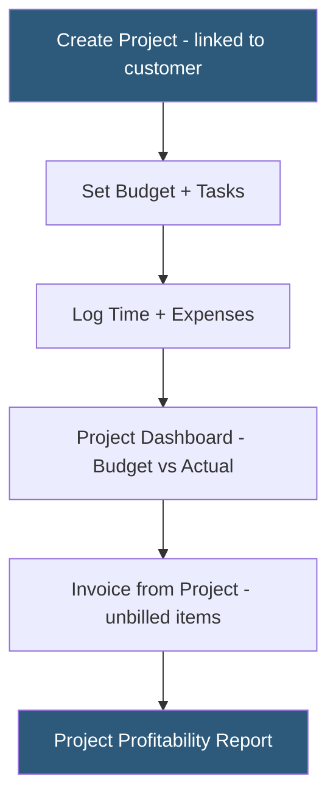

**Category:** Accounting Software Platforms
**Difficulty:** Intermediate
**Reading time:** 5 min read

---

Xero Projects is an add-on module for tracking time and costs against client projects, calculating project profitability, and invoicing clients for actual time and expenses incurred. It is sold as a per-user add-on to Xero Standard and Premium plans, targeting service businesses that bill by time and materials.

- **Project** — a container linked to a customer for grouping time entries, expenses, and fixed-fee charges
- **Time tracking** — manual or timer-based entry of hours against a project and task, with billable/non-billable designation
- **Project budget** — total fee or cost budget set at project start, used to calculate percentage-complete and over-budget alerts
- **Invoice from project** — the ability to create invoices directly from a project pulling unbilled time and expense items into line items
- **Project profitability report** — summary showing quoted vs actual costs, estimated vs invoiced revenue, and net project margin

Xero Projects sits within the Xero interface as a dedicated module. Each project is created with a customer association, optional deadline, and cost budget. Tasks are defined within the project (e.g., "Design," "Development," "QA") with individual time budgets and hourly rates. Staff log time against tasks either via the Xero Projects mobile app (which has a built-in timer) or via manual entry in the web interface.

Expenses incurred for a project — purchases, travel, materials — are recorded as project expenses linked to invoices or bills in Xero's main accounting module. This linkage means the P&L impact flows through the full accounting system while the project view aggregates both time and material costs.

The "Invoice from Project" workflow creates an invoice draft pre-populated with all unbilled time and expense items. Hourly time items calculate the invoice line amount by multiplying hours by the task rate. Fixed-price milestones create flat-fee invoice lines. Partial invoicing is supported — invoicing 50% of the project budget at the midpoint.

Pricing is per active project user per month, charged in addition to the Xero subscription. Businesses with 5 staff logging time pay for 5 project users.

- Creative agency tracking time across client projects and invoicing for time and materials monthly
- IT consultancy monitoring project profitability across fixed-fee engagements
- Engineering firm tracking billable vs non-billable hours per project for utilization reporting
- Freelancer logging time against client projects and invoicing from the mobile app

| Advantage | Disadvantage |
|-----------|--------------|
| Native Xero integration means project costs flow directly into accounting with no sync | Per-user pricing adds cost for larger teams with many time-tracking staff |
| Invoice from project eliminates manual timesheet to invoice transfer | Less powerful than dedicated project management + time tracking tools like Harvest or Teamwork |
| Mobile app timer enables accurate time capture during client work | No Gantt charts, task dependencies, or resource planning capabilities |

- [Xero Standard Plan](xero-standard-plan.md)
- [Xero Expenses Tracking](xero-expenses-tracking.md)
- [FreshBooks Accounting Software](freshbooks-accounting-software.md)

---
*Part of the [Accounting Software Platforms](index.md) category · [Back to Master Index](../../index.md)*
