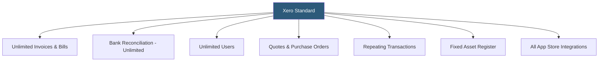

**Category:** Accounting Software Platforms
**Difficulty:** Beginner
**Reading time:** 5 min read

---

Xero Standard is the most popular Xero plan, removing all transaction volume limits from the Starter tier while maintaining the same unlimited user model, making it suitable for active small to mid-size businesses with regular invoicing and bill payment activity. It represents the baseline Xero experience for most operational businesses.

- **Unlimited transactions** — Standard removes the 20-invoice and 5-bill monthly caps, allowing unrestricted invoicing and bill entry
- **Bulk reconciliation** — the ability to reconcile hundreds of bank transactions in a single session using reconciliation rules and batch matching
- **Quotes** — full quote-to-invoice workflow with quote acceptance tracking and automatic conversion upon client approval
- **Repeating invoices and bills** — automated recurring transaction creation on defined schedules for monthly retainers, subscriptions, and regular vendor payments
- **Fixed asset register** — tracking depreciable assets with automatic depreciation journal entries using straight-line or diminishing value methods

Standard unlocks the full Xero operational accounting workflow. The fixed asset register tracks capital expenditures as assets, applies depreciation schedules (straight-line, diminishing value, or flat rate), and posts monthly depreciation entries automatically. Assets are linked to liability accounts for financed equipment and to expense accounts for disposals.

Purchase orders in Standard (not available in Starter) allow businesses to issue formal POs to vendors before goods or services are received. When goods arrive, the PO converts to a bill with the ordered quantities and agreed prices pre-populated, ensuring three-way matching between PO, receipt, and bill.

Repeating invoices send automatically to clients on defined schedules — weekly, monthly, quarterly — either as draft items for review or sent directly to clients. This eliminates the manual effort of creating recurring invoices for subscription-based service businesses.

- Service business billing 30+ clients monthly needing unlimited invoicing without volume caps
- Retail business tracking fixed assets (equipment, leasehold improvements) with automatic depreciation
- Business issuing formal purchase orders to multiple vendors needing PO-to-bill workflow
- Professional services firm with repeating monthly retainer invoices to ongoing clients

| Advantage | Disadvantage |
|-----------|--------------|
| Unlimited transactions at a competitive monthly rate | No multi-currency without upgrading to Premium plan |
| Fixed asset register eliminates manual depreciation spreadsheets | Project tracking requires purchasing Xero Projects add-on separately |
| Purchase order workflow enables proper procurement approval | Expense claims module for employees requires Xero Expenses add-on |

- [Xero Starter Plan](xero-starter-plan.md)
- [Xero Premium Plan](xero-premium-plan.md)
- [QuickBooks Online Plus](quickbooks-online-plus.md)

---
*Part of the [Accounting Software Platforms](index.md) category · [Back to Master Index](../../index.md)*
