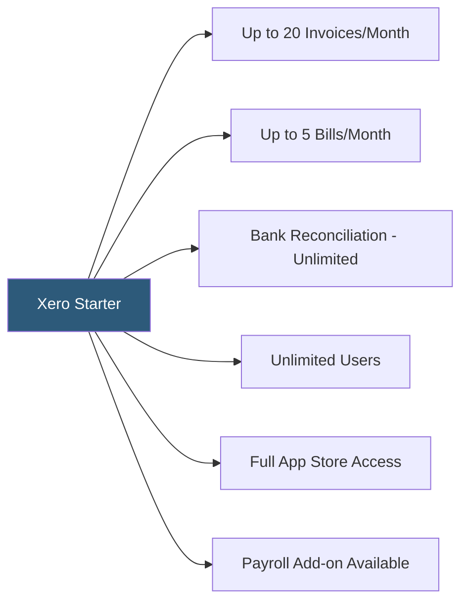

**Category:** Accounting Software Platforms
**Difficulty:** Beginner
**Reading time:** 5 min read

---

Xero Starter is the entry-level Xero subscription with transaction volume limits — 20 invoices/quotes and 5 bills per month — designed for the very smallest businesses or those in the startup phase testing the platform before committing to higher tiers. Despite the limits, it includes unlimited users, bank reconciliation, and the full Xero App Store.

- **Transaction limits** — Starter restricts to 20 invoices/quotes and 5 bills monthly; exceeding these requires upgrading to Standard or Premium
- **Bank reconciliation** — full access to Xero's bank reconciliation workflow with bank feeds and reconciliation rules
- **Expense claims** — employees can submit expense reports for reimbursement through the Xero Expenses module (available as an add-on)
- **Unlimited users** — like all Xero plans, Starter includes unlimited user seats, allowing full team access
- **Xero App Store** — all 1,000+ third-party integrations remain available even on the Starter plan

Starter provides the core Xero accounting engine with artificial caps on outgoing invoices and incoming bills. The caps reset on the first day of each calendar month. When the monthly limit is reached, Xero prevents creating additional invoices or bills until the billing period resets or the plan is upgraded. Quotes count toward the invoice limit when converted to invoices.

The Starter plan is most suitable for businesses with extremely low transaction volumes — service businesses billing 1–5 clients monthly — or businesses in a pre-revenue phase wanting to set up their chart of accounts and bank reconciliation structure before volume increases. Many accountants start new clients on Starter to establish a clean accounting setup before moving to Standard.

Bank feeds, reconciliation rules, and all reporting features are fully available without limits. Multi-currency support is available if enabled in the Xero account settings. The Xero App Store integrations all work with Starter, meaning inventory management, payroll, and e-commerce sync apps function normally — the caps only apply to native Xero invoice and bill objects.

- Newly registered business testing Xero before committing to Standard plan pricing
- Freelancer billing 5–10 clients per month who can manage within the 20-invoice limit
- Pre-revenue startup setting up accounting structure ahead of first client contracts
- Accountant establishing a clean QBO chart of accounts for a new client before transaction volume increases

| Advantage | Disadvantage |
|-----------|--------------|
| Lowest cost entry into Xero with full functionality except volume caps | 20-invoice limit is easily exceeded by any active service business |
| Unlimited users even at the entry tier | Plan cost relative to QBO Simple Start is slightly higher with more restrictive caps |
| Full App Store access enables integrations even at minimum tier | Upgrading mid-month requires paying the higher plan rate for the entire remaining month |

- [Xero Accounting Platform](xero-accounting-platform.md)
- [Xero Standard Plan](xero-standard-plan.md)
- [Wave Accounting Platform](wave-accounting-platform.md)

---
*Part of the [Accounting Software Platforms](index.md) category · [Back to Master Index](../../index.md)*
