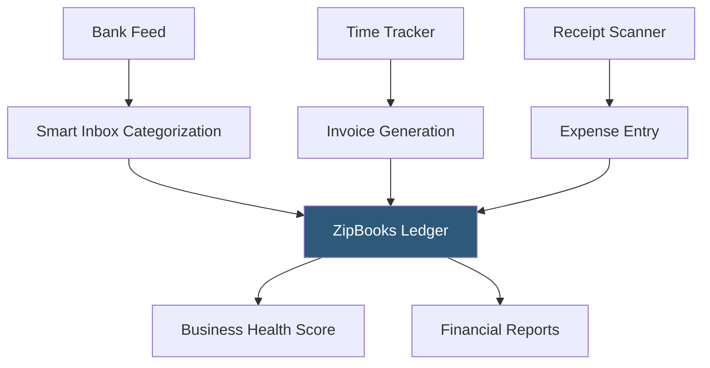

**Category:** Accounting Software Platforms
**Difficulty:** Beginner
**Reading time:** 4 min read

---

ZipBooks is a cloud accounting platform offering a free tier and paid plans targeting small businesses, freelancers, and accounting professionals managing multiple clients. It differentiates through a business health score feature that rates financial performance and a built-in time tracking module integrated with invoicing.

- **Business health score** — ZipBooks' proprietary metric that analyzes receivables aging, expense ratios, and profit margins to generate a numeric score indicating overall financial health
- **Smart inbox** — automated transaction categorization inbox where bank feed transactions are suggested for categorization based on historical patterns
- **Accounting firm tier** — ZipBooks Accountant plan lets bookkeepers and accountants manage multiple client books from a single dashboard, similar to QuickBooks Accountant
- **Time tracking integration** — built-in timer that tracks billable hours and converts tracked time directly into invoice line items without manual data transfer
- **Receipt scanning** — mobile OCR scanning that extracts vendor name, date, and amount from receipt photos and pre-populates expense entries

ZipBooks connects to bank accounts via Plaid-based bank feeds. The smart inbox presents uncategorized transactions with AI-suggested categories; users accept or reassign categories, building a pattern library that improves future suggestions. Confirmed transactions populate the double-entry ledger automatically.

The time tracking module allows recording billable and non-billable time against clients. When generating an invoice, ZipBooks pulls unbilled time entries and presents them as invoice line items — the user selects which tracked hours to include and ZipBooks calculates the amount at the configured hourly rate.

The business health score evaluates four dimensions: profitability (net margin trend), expenses (expense ratio), receivables (aging and DSO), and payment history (on-time customer payments). The score updates monthly and provides plain-language recommendations for improving weaker dimensions.

ZipBooks' free tier (Starter) supports unlimited invoices, one user, and bank connections, making it genuinely usable for early-stage freelancers. Paid plans unlock smart inbox, time tracking, reporting, and accountant access.

- Freelance consultant tracking billable hours and converting them to invoices within the same tool
- Small business owner using the health score to identify that receivables aging is the biggest risk to cash flow
- Bookkeeper managing 15 small business clients from the ZipBooks Accountant dashboard
- Startup using the free plan for basic invoicing and expense tracking before revenue justifies a paid plan

| Advantage | Disadvantage |
|-----------|--------------|
| Generous free tier with unlimited invoicing enables cost-free start | Smaller integration ecosystem than QuickBooks or Xero limits connectivity with other SaaS tools |
| Business health score provides actionable financial insight without manual analysis | Advanced reporting features require Sophisticated plan, increasing cost for growing businesses |
| Built-in time tracking eliminates need for a separate time tracking tool | Less established than major competitors; smaller community and fewer accountant-familiar users |

- [FreshBooks Accounting Software](freshbooks-accounting-software.md)
- [Wave Invoicing](wave-invoicing.md)
- [Kashoo Cloud Accounting](kashoo-cloud-accounting.md)

---
*Part of the [Accounting Software Platforms](index.md) category · [Back to Master Index](../../index.md)*
