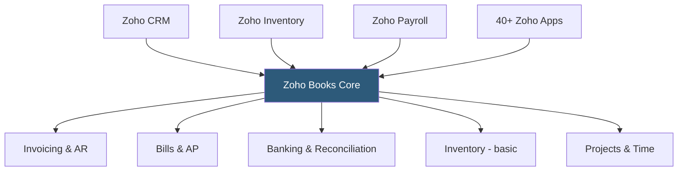

**Category:** Accounting Software Platforms
**Difficulty:** Intermediate
**Reading time:** 6 min read

---

Zoho Books is a cloud accounting platform within the Zoho business application ecosystem, offering competitive pricing, tight integration with Zoho CRM, Zoho Inventory, and 40+ other Zoho apps, and strong compliance features for GST/VAT in India, the UK, and other markets. It matters as the best-value accounting platform for businesses already in the Zoho ecosystem.

- **Zoho One integration** — Zoho Books connects natively with all Zoho applications when subscribed to Zoho One, creating a unified CRM-to-accounting data flow
- **Client portal** — a secure portal where clients view invoices, make payments, and review statements without contacting the business
- **Workflow automation** — rule-based triggers in Zoho Books that send follow-up emails, create tasks, or notify staff based on accounting events
- **GST/VAT compliance** — built-in tax calculation, return filing, and e-invoicing compliance for India GST, UK VAT, Australian GST, and other jurisdictions
- **Accountant access** — a dedicated portal for the business's accountant with full file access at no additional cost

Zoho Books operates on a multi-tenant cloud architecture with ISO 27001-certified data centers. The accounting engine is double-entry with a full chart of accounts, journals, and multi-currency support across all plans. Bank feeds connect to over 50 countries' financial institutions via direct bank connections or Yodlee aggregation.

The Zoho ecosystem integration is the platform's strongest differentiator. When Zoho Books and Zoho CRM are connected, approved quotes in CRM convert to invoices in Books without re-entry. Customer payment status in Books updates CRM contact records in real time. This bidirectional sync eliminates the disconnection between sales pipeline and accounting revenue recognition common in multi-tool setups.

Zoho Books' workflow engine allows configuring triggers on any accounting event — when an invoice is overdue by 7 days, send an email template; when a bill is approved, notify the accounts payable manager via Zoho Cliq (the Zoho messaging app). Workflows automate routine follow-up without requiring integration middleware like Zapier.

Tax compliance modules are pre-built for specific jurisdictions. Indian users get GST invoice generation, e-way bills, GSTR-1/3B return preparation, and reconciliation with the GSTN portal. UK users get MTD (Making Tax Digital) VAT return filing integration. This makes Zoho Books a leading choice in India and strong in Commonwealth markets.

- Indian SMB needing built-in GST compliance, e-invoicing, and GSTN portal integration
- Zoho CRM user wanting quotes to convert to invoices without data re-entry
- Multi-product business using Zoho Inventory for warehouse management with Books for financial accounting
- UK business needing MTD VAT compliance without third-party filing software

| Advantage | Disadvantage |
|-----------|--------------|
| Best-in-class Zoho ecosystem integration eliminates multi-tool friction | Less accountant ecosystem than QBO in North America; smaller partner network |
| Competitive pricing with strong feature coverage at lower tiers | Support quality varies; complex issues can require extensive back-and-forth |
| Jurisdiction-specific tax compliance built in for India, UK, Australia | Interface less polished than FreshBooks for client-facing invoice workflows |

- [Zoho Books Professional Plan](zoho-books-professional-plan.md)
- [FreshBooks Accounting Software](freshbooks-accounting-software.md)
- [Xero Accounting Platform](xero-accounting-platform.md)

---
*Part of the [Accounting Software Platforms](index.md) category · [Back to Master Index](../../index.md)*
