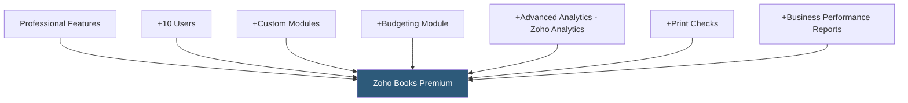

**Category:** Accounting Software Platforms
**Difficulty:** Intermediate
**Reading time:** 5 min read

---

Zoho Books Premium is the highest standard tier before enterprise contracts, supporting 10 users and adding advanced features — custom domain, business performance reports, 10 custom modules, and budgeting — making it suitable for mid-size businesses with complex reporting and multi-user workflow requirements.

- **10 users** — Premium nearly doubles the Professional plan's 5-user limit, accommodating larger accounting and operations teams
- **Custom modules** — user-defined data modules that extend Zoho Books with industry-specific fields and record types not available in standard configuration
- **Budgeting** — period-based budget creation across accounts with budget vs actuals variance reporting
- **Advanced analytics** — integration with Zoho Analytics for custom BI dashboards and multi-dimensional financial analysis beyond standard reports
- **Print checks** — physical check printing functionality for accounts payable payments

Custom modules in Premium allow creating new record types with user-defined fields that integrate with core Zoho Books objects. For example, a construction company might create a "Project Phase" module linked to jobs, with custom fields for phase codes, estimated materials, and completion percentages. These modules extend the platform's data model without custom development.

Zoho Analytics integration provides a self-service BI layer on top of Zoho Books data. Users build custom dashboards combining financial metrics with operational data from other Zoho apps. Pre-built report templates cover AR aging trends, revenue by customer segment, expense trends, and cash flow forecasting, with drag-and-drop customization available.

Budgeting allows defining annual or period-based budgets for income and expense accounts. The budget vs actuals report shows variance by account and time period, flagging accounts exceeding budget thresholds. Scenario budgeting enables what-if analysis with multiple budget versions (optimistic, conservative, base case).

- Mid-size service business with 8 accounting staff needing simultaneous access to AR, AP, and reporting
- Business requiring custom data fields to capture industry-specific transaction details
- CFO-level reporting using Zoho Analytics dashboards to present KPIs to leadership monthly
- Business needing formal budget-to-actuals reporting for department expense accountability

| Advantage | Disadvantage |
|-----------|--------------|
| Custom modules extend data model without requiring development resources | 10-user limit requires Enterprise tier for larger organizations |
| Zoho Analytics integration provides enterprise BI capabilities within Zoho ecosystem | Advanced analytics requires Zoho Analytics subscription (additional cost) |
| Competitive pricing for the feature depth at Premium | Less established in English-speaking markets outside India versus QBO or Xero |

- [Zoho Books Professional Plan](zoho-books-professional-plan.md)
- [Zoho Books Accounting](zoho-books-accounting.md)
- [NetSuite ERP Financials](netsuite-erp-financials.md)

---
*Part of the [Accounting Software Platforms](index.md) category · [Back to Master Index](../../index.md)*
