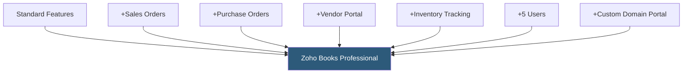

**Category:** Accounting Software Platforms
**Difficulty:** Intermediate
**Reading time:** 5 min read

---

Zoho Books Professional is the mid-tier plan adding purchase orders, sales orders, vendor portal, and inventory management to the Standard plan's feature set, supporting 5 users and covering the full order-to-cash and procure-to-pay cycles that product-based businesses require.

- **Sales orders** — formal order records from customers before invoice generation, enabling backorder tracking and fulfillment workflows
- **Purchase orders** — formal procurement requests sent to vendors, linking receiving against the PO and auto-generating bills upon receipt
- **Vendor portal** — a self-service portal where vendors view PO status, submit invoices, and acknowledge purchase orders
- **Inventory management** — FIFO-based item tracking with stock levels, reorder points, and low-stock alerts
- **Custom domain for portal** — hosting the client and vendor portals on a custom subdomain for brand consistency

The Professional plan adds the full order management layer missing from Standard. Sales orders record customer commitments before goods ship, enabling backorder management and pick/pack workflows linked to inventory availability. When items ship, the sales order converts to an invoice, maintaining the order-to-bill audit trail.

Purchase orders flow to vendors via email or the vendor portal. Vendors can acknowledge receipt and submit invoices via the portal, reducing manual bill entry. Upon goods receipt, the matching purchase order is converted to a bill with quantity and price pre-populated from the PO, enabling three-way PO-receipt-bill matching.

Inventory in Professional tracks on-hand quantities using FIFO costing. When items are sold, COGS is recorded using the oldest cost layer first. Reorder points trigger automatic low-stock notifications. Inventory reports show stock value by item, movement history, and items approaching reorder points.

- Small distributor managing customer orders, vendor procurement, and inventory with 4 staff in accounting
- Retailer issuing purchase orders to suppliers and receiving goods against POs before paying bills
- Wholesale business using the vendor portal to reduce manual bill entry by having suppliers self-submit invoices
- Manufacturer tracking raw material inventory costs using FIFO for cost of goods calculation

| Advantage | Disadvantage |
|-----------|--------------|
| Full procure-to-pay and order-to-cash cycle in one platform | Inventory management basic for complex multi-warehouse operations |
| Vendor portal reduces AP data entry burden | 5-user limit restrictive for growing businesses |
| Competitive pricing compared to QBO Plus for similar feature coverage | Zoho Books inventory less capable than dedicated Zoho Inventory for complex operations |

- [Zoho Books Accounting](zoho-books-accounting.md)
- [Zoho Books Premium Plan](zoho-books-premium-plan.md)
- [QuickBooks Online Plus](quickbooks-online-plus.md)

---
*Part of the [Accounting Software Platforms](index.md) category · [Back to Master Index](../../index.md)*
