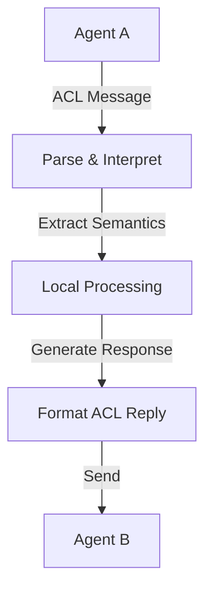

**Category:** Agent Communication Protocols
**Difficulty:** Intermediate
**Reading time:** 6 min read

---

ACL (Agent Communication Language) is a standardized formal language designed for agents to exchange structured information and make requests. It provides a common syntax and semantics for agent-to-agent dialogue, enabling heterogeneous agents to communicate regardless of their internal implementation or platform.

- **Performative** — The action being requested (e.g., inform, request, query)
- **Content** — The actual message or knowledge being communicated
- **Sender/Receiver** — Identifiers for the communicating agents
- **Conversation ID** — Unique identifier linking related messages in a dialogue
- **Semantics** — Formal meaning of messages independent of implementation

ACL follows a structured format where each message contains a performative (the communication act), the sender and receiver agents, a conversation ID for tracking dialogue threads, and content expressing what is being communicated. The receiver parses this standardized format and extracts the formal semantic meaning. Unlike natural language, ACL eliminates ambiguity by defining precise meanings for each performative. This allows agents to reliably interpret intentions. ACL is protocol-agnostic—messages can be transported via HTTP, AMQP, or other mechanisms. Standards like FIPA ACL define specific performatives such as request, inform, query, deny, and agree, enabling predictable interaction patterns.

- Multi-agent systems where agents from different vendors need to collaborate
- Workflow automation involving diverse autonomous agents
- Agent negotiation protocols requiring formal language semantics
- Distributed problem-solving with heterogeneous agent teams
- Systems requiring provable agent communication contracts

| Advantage | Disadvantage |
|-----------|--------------|
| Formal semantics prevent ambiguity | Steeper learning curve than natural language |
| Protocol-independent transport | Verbose compared to compact binary formats |
| Enables reliable agent collaboration | Requires standardization across systems |
| Supports structured dialogue patterns | Limited expressiveness for complex concepts |
| Framework for agent reasoning | Additional parsing overhead |

- [FIPA agent standards](fipa-agent-standards.md)
- [Multi-Agent System protocols](multi-agent-system-protocols.md)
- [Agent coordination mechanisms](agent-coordination-mechanisms.md)

---
*Part of the [Agent Communication Protocols](agent-communication-protocols/index.md) category · [Back to Master Index](../../index.md)*
