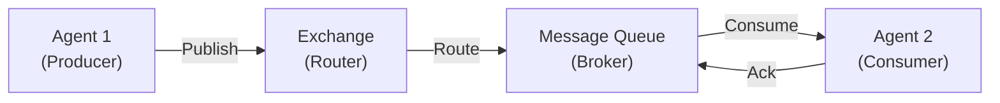

**Category:** Agent Communication Protocols
**Difficulty:** Intermediate
**Reading time:** 6 min read

---

AMQP (Advanced Message Queuing Protocol) is an open standard protocol designed for reliable messaging between agents and systems. It provides durable, asynchronous communication patterns essential for building scalable multi-agent systems. AMQP ensures message delivery guarantees and decouples communication dependencies between agents.

- **Message Queue** — Persistent storage for messages awaiting processing by agents
- **Exchange** — Message routing component that directs messages to appropriate queues
- **Queue Binding** — Association between exchanges and queues with routing rules
- **Acknowledgment** — Confirmation mechanism ensuring message delivery and processing
- **Durability** — Persistence feature that protects messages from system failures

AMQP operates as a message broker system where agents publish messages to exchanges rather than directly to other agents. Exchanges analyze message attributes and route them to appropriate queues based on binding rules. Consumer agents connect to queues, retrieve messages, and process them. Upon successful processing, agents send acknowledgments back to the broker, which removes the message from the queue. This decoupled architecture allows agents to operate independently without knowing about each other's existence or availability. Multiple agents can consume from the same queue for load balancing, and messages persist if agents are temporarily unavailable.

- Real-time agent coordination in distributed systems
- Load balancing message processing across multiple agents
- Reliable task distribution in multi-agent workflows
- Event-driven agent communication architectures
- Asynchronous inter-agent communication with persistence

| Advantage | Disadvantage |
|-----------|--------------|
| Reliable message delivery guarantees | Additional infrastructure complexity |
| Decoupling of agent dependencies | Performance overhead compared to direct calls |
| Horizontal scalability for agents | Message ordering constraints in some cases |
| Message durability and persistence | Configuration and management requirements |
| Built-in load balancing support | Learning curve for AMQP concepts |

- [Message queue integration](message-queue-integration.md)
- [Event-driven agent architecture](event-driven-agent-architecture.md)
- [Agent coordination mechanisms](agent-coordination-mechanisms.md)

---
*Part of the [Agent Communication Protocols](agent-communication-protocols/index.md) category · [Back to Master Index](../../index.md)*
