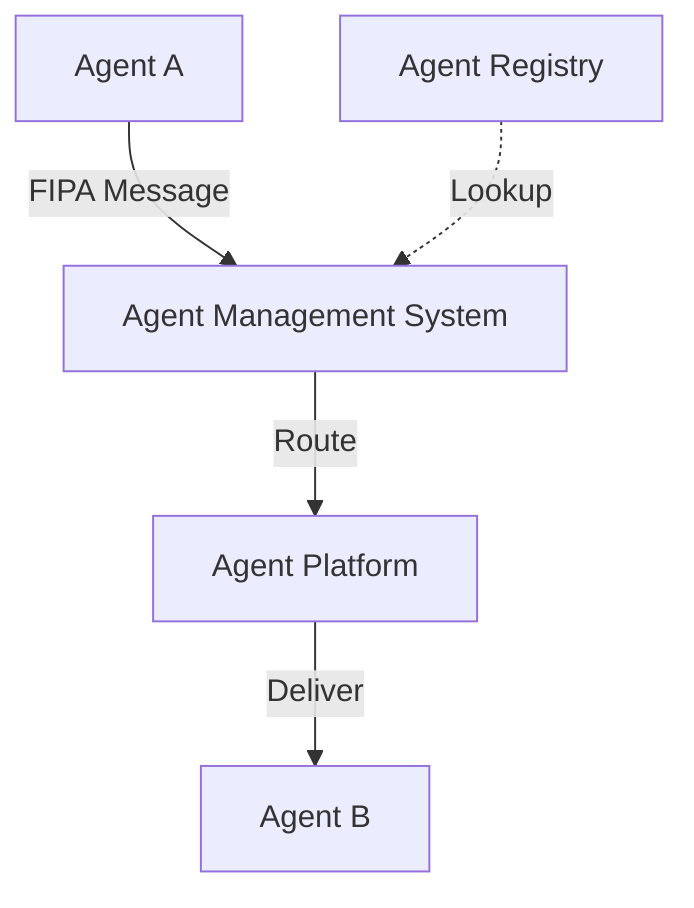

**Category:** Agent Communication Protocols
**Difficulty:** Intermediate
**Reading time:** 6 min read

---

FIPA (Foundation for Intelligent Physical Agents) standards define a comprehensive framework for agent communication, interaction protocols, and system architecture. These standards enable interoperability between different agent platforms and define common semantics for agent-to-agent communication across distributed systems.

- **Agent Platform** — The runtime environment that hosts and manages agents
- **Agent Management System (AMS)** — Manages agent lifecycle and directory services
- **Message Transport Protocol** — HTTP, IIOP, or other underlying transport
- **Interaction Protocols** — Standardized conversation patterns like contract-net
- **Agent Identification** — Global naming convention for agents across systems

FIPA standards provide a layered architecture where agents register with an Agent Management System (AMS) on their platform. The AMS maintains a directory of available agents and manages agent lifecycle events like creation, suspension, and termination. When Agent A wants to communicate with Agent B, it sends messages formatted according to FIPA specifications through the Agent Communication Channel (ACC). The ACC can use various transport protocols (HTTP, IIOP, XMPP) while maintaining standard message format. FIPA also defines standard interaction protocols such as the Contract-Net protocol for negotiation, enabling agents to follow predictable communication patterns. This standardization allows agents developed on different platforms (JADE, Zeus, JACK) to interoperate seamlessly.

- Integrating agent systems built on different platforms
- Enterprise agent systems requiring standardized governance
- Research projects needing interoperable agent implementations
- Systems with strict requirement for formal specification compliance
- Multi-agent markets and trading platforms

| Advantage | Disadvantage |
|-----------|--------------|
| Formal specification enables interoperability | Complex standard with steep learning curve |
| Platform-independent agent communication | Overhead from strict compliance requirements |
| Standardized lifecycle management | Many features go unused in simple systems |
| Well-defined protocols for negotiation | Limited adoption compared to modern approaches |
| Governance and security frameworks | Performance impact from standardized messaging |

- [Agent Communication Language (ACL)](agent-communication-language-acl.md)
- [Agent coordination mechanisms](agent-coordination-mechanisms.md)
- [Contract Net Protocol](contract-net-protocol.md)

---
*Part of the [Agent Communication Protocols](agent-communication-protocols/index.md) category · [Back to Master Index](../../index.md)*
