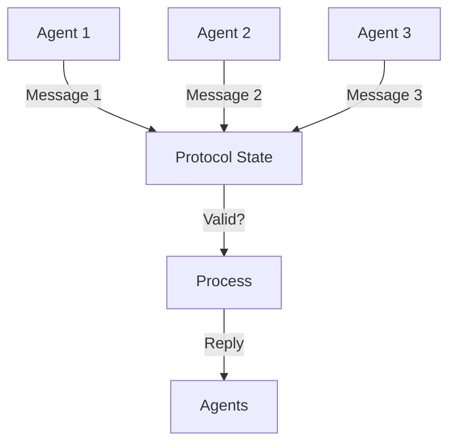

**Category:** Agent Communication Protocols
**Difficulty:** Intermediate
**Reading time:** 6 min read

---

Multi-Agent System (MAS) protocols define standardized communication and coordination rules for systems where multiple autonomous agents interact to achieve collective or individual goals. These protocols ensure reliable cooperation, prevent deadlocks, and enable efficient resource sharing in distributed environments.

- **Protocol Specification** — Formal definition of valid message sequences and states
- **State Machine** — Tracks conversation states and valid transitions
- **Termination Conditions** — Rules defining when protocols complete
- **Exception Handling** — Mechanisms for dealing with failures or violations
- **Synchronization** — Ensuring coordinated action across multiple agents

MAS protocols establish rules that govern legal sequences of messages and transitions between conversation states. Each protocol is typically modeled as a finite state machine where states represent conversation phases and transitions represent valid messages. When an agent receives a message, the protocol handler checks if the message is valid given the current state. Invalid messages may be rejected or trigger exception handling. Protocols often implement handshaking mechanisms to establish shared understanding before substantive communication. Timeouts prevent indefinite waiting for responses. MAS protocols coordinate multi-agent actions by requiring agents to follow the same state machine, ensuring compatible behavior without requiring centralized control.

- Negotiation protocols in procurement and trading systems
- Task allocation protocols for distributed computing
- Coordination protocols for manufacturing and logistics
- Sensor networks requiring synchronized data collection
- Supply chain coordination between autonomous partners

| Advantage | Disadvantage |
|-----------|--------------|
| Ensures predictable multi-agent behavior | Complex to design correctly |
| Prevents deadlocks through formal specification | Rigid protocols limit flexibility |
| Enables verification of correctness | Overhead from protocol machinery |
| Clear semantics for agent developers | Difficult to extend existing protocols |
| Supports heterogeneous agent systems | Requires all agents follow same protocol |

- [Contract Net Protocol](contract-net-protocol.md)
- [Agent coordination mechanisms](agent-coordination-mechanisms.md)
- [Request-response patterns](request-response-patterns.md)

---
*Part of the [Agent Communication Protocols](agent-communication-protocols/index.md) category · [Back to Master Index](../../index.md)*
