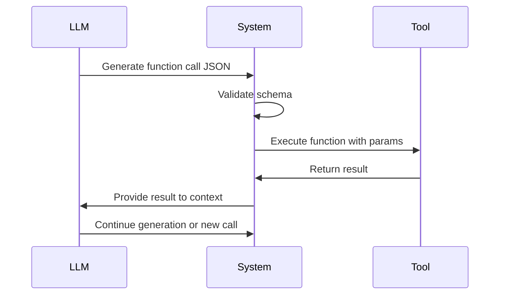

**Category:** Agent Communication Protocols
**Difficulty:** Intermediate
**Reading time:** 6 min read

---

OpenAI's function calling protocol enables language models to invoke external tools and APIs by returning structured JSON function calls. This protocol standardizes agent-tool interaction, enabling complex workflows and integrations with external systems.

- **Function Schema** — JSON Schema defining available functions and parameters
- **Structured Output** — Models return function calls as JSON objects
- **Tool Use Loop** — Agent calls function, receives result, continues generation
- **Error Handling** — Managing invalid functions and parameter validation
- **Multi-Tool Orchestration** — Coordinating across multiple function calls

The function calling protocol begins with defining function schemas—JSON Schemas describing available functions, their parameters, descriptions, and types. When an LLM receives a prompt, it can choose to generate function calls in addition to text. These calls are structured JSON specifying function name and parameters. The system validates calls against schemas and executes the named function. Results are returned to the LLM as additional context. The LLM can chain multiple function calls, interpret results, and determine next steps. This creates a closed loop where the AI acts as an agent, making decisions about which tools to use.

- Building AI assistants with external tool access
- Autonomous workflow automation
- Data retrieval and analysis agents
- Customer service chatbots with business system access
- Research and analysis tools with web search
- Complex multi-step task automation

| Advantage | Disadvantage |
|-----------|--------------|
| Structured, reliable tool invocation | Requires well-defined function schemas |
| Built directly into OpenAI models | Limited to OpenAI API models |
| Simple JSON-based integration | Error handling adds complexity |
| Supports complex tool chaining | Model must understand function purpose |
| Works well with existing APIs | Hallucination of function names |

- [Anthropic Tool Use Protocol](anthropic-tool-use-protocol.md)
- [OpenAPI Specification for Agents](openapi-specification-for-agents.md)
- [JSON-RPC for Agent Communication](json-rpc-for-agent-communication.md)

---
*Part of the [Agent Communication Protocols](index.md) category · [Back to Master Index](../../index.md)*
