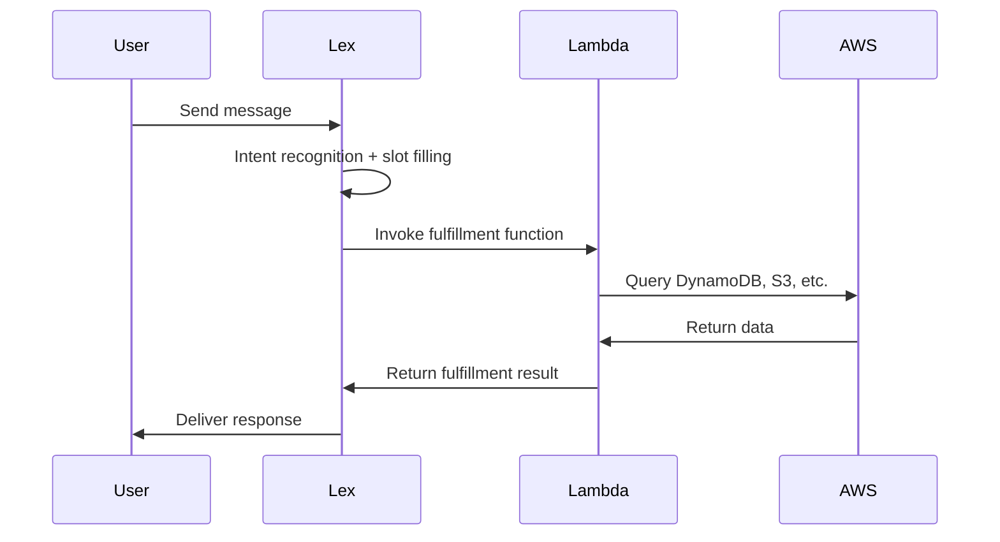

**Category:** AI Agent Development Frameworks
**Difficulty:** Intermediate
**Reading time:** 6 min read

---

Amazon Lex is AWS's conversational AI service enabling building of chatbots with natural language understanding. It uses the same deep learning technology powering Alexa, providing strong NLU capabilities integrated with AWS services for enterprise deployments.

- **Intent** — User goal, primary action unit
- **Slot** — Parameter or contextual information
- **Utterance** — Example phrase matching an intent
- **Fulfillment** — Lambda function handling the intent
- **Prompt** — Question for gathering missing information
- **Session attribute** — State preserved across turns
- **Bot alias** — Version identifier for deployment

Developers define bots by creating intents with sample utterances and slots for required parameters. Lex's NLU engine, trained on vast Alexa data, matches user input to intents with high accuracy. When slots are missing, Lex automatically prompts the user. Once all required information is gathered, Lex invokes a Lambda function for fulfillment. The Lambda function handles business logic—querying databases, calling APIs, processing transactions—and returns a response to Lex. Session attributes enable maintaining state across conversation turns. Lex integrates seamlessly with AWS services: storing conversation logs in S3, using CloudWatch for monitoring, and integrating with AWS Identity and Access Management for authorization. Multi-platform deployment supports web clients, Facebook Messenger, Slack, and Alexa.

- Enterprise customer service bots
- AWS service automation and support
- Transaction processing and payment bots
- Alexa skill development
- Multi-channel customer engagement
- Internal IT support automation
- Complex form-filling and data collection

| Advantage | Disadvantage |
|-----------|--------------|
| Powered by Alexa technology, strong NLU | AWS lock-in for enterprise features |
| Seamless AWS service integration | Pricing can be high at scale |
| Automatic slot filling and prompt | Less control than code-first frameworks |
| Built-in analytics and monitoring | Complexity for simple use cases |
| Enterprise-grade reliability | Learning curve for Lambda integration |

- [Dialogflow agent builder](dialogflow-agent-builder.md)
- [Microsoft Bot Framework](microsoft-bot-framework.md)
- [Botpress conversational agents](botpress-conversational-agents.md)

---
*Part of the [AI Agent Development Frameworks](index.md) category · [Back to Master Index](../../index.md)*
