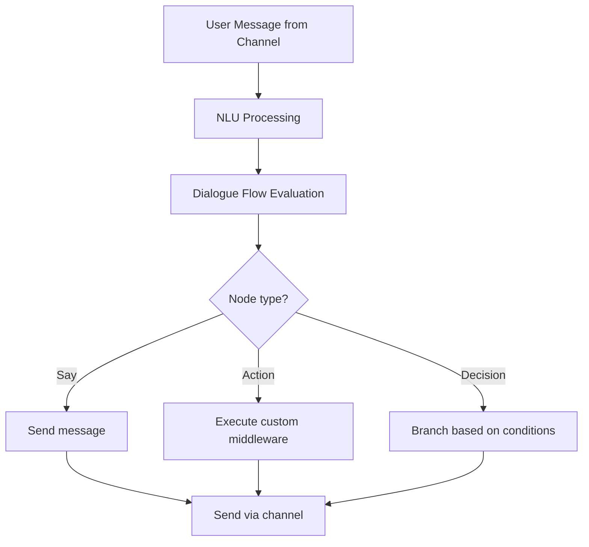

**Category:** AI Agent Development Frameworks
**Difficulty:** Intermediate
**Reading time:** 6 min read

---

Botpress is a visual conversational AI platform offering low-code/no-code bot building alongside custom coding capabilities. It combines dialogue design tools, NLU processing, and integration with messaging platforms, enabling rapid development of production-grade chatbots.

- **Visual builder** — No-code dialogue flow design
- **Node-based workflows** — Graphical conversation representation
- **NLU engine** — Intent/entity recognition
- **Content elements** — Text, cards, buttons, forms
- **Middleware** — Custom processing at various stages
- **Webhooks** — Integration with external services
- **Multi-channel deployment** — Web, Facebook, Slack, etc.

Botpress provides a visual editor for designing dialogue flows as node graphs, where nodes represent steps like questions, statements, or branching. Each node can trigger conditions, validate inputs, or execute custom JavaScript middleware. When a user sends a message, Botpress processes it through NLU to extract intent, then evaluates the dialogue flow to determine the next node. Custom middleware allows integration with databases, APIs, and complex business logic without leaving the platform. Webhooks enable two-way integration with external systems. The platform handles multi-channel deployment, abstracting away platform-specific formatting. This combination of visual design (for rapid iteration) and code extensibility (for complex logic) allows teams to build bots rapidly while maintaining sophisticated capabilities.

- Customer service and support automation
- Lead qualification and sales bots
- FAQ and knowledge base bots
- Appointment and reservation systems
- Internal HR and IT helpdesk bots
- Product recommendations
- Multi-channel conversational marketing

| Advantage | Disadvantage |
|-----------|--------------|
| No-code visual building for rapid development | Platform lock-in concerns |
| Supports custom code when needed | Hosting and licensing costs |
| Multi-channel deployment simplified | Limited transparency into NLU training |
| Built-in NLU without external APIs | Learning curve for visual system |
| Good community and marketplace integrations | May be overkill for simple bots |

- [Rasa conversational AI agents](rasa-conversational-ai-agents.md)
- [Dialogflow agent builder](dialogflow-agent-builder.md)
- [Amazon Lex conversational bots](amazon-lex-conversational-bots.md)

---
*Part of the [AI Agent Development Frameworks](index.md) category · [Back to Master Index](../../index.md)*
