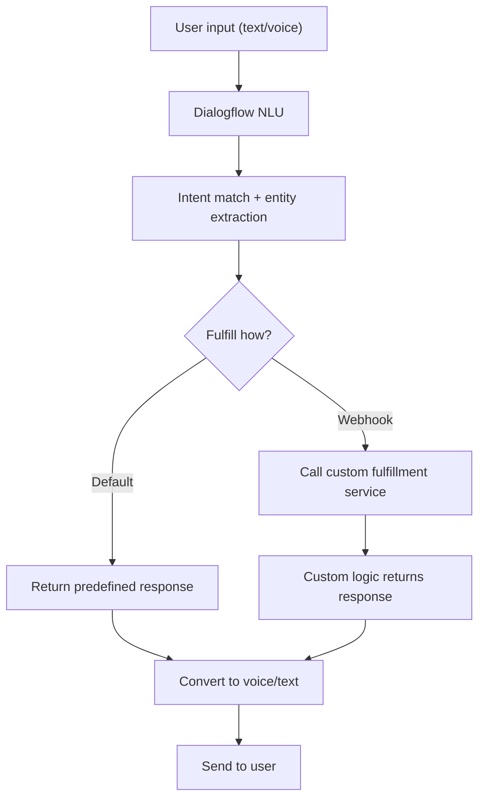

**Category:** AI Agent Development Frameworks
**Difficulty:** Intermediate
**Reading time:** 6 min read

---

Google Dialogflow is a conversational AI platform enabling building of chatbots and voice assistants through visual design and NLU training. It abstracts infrastructure complexity, providing scalable agent hosting with built-in NLU, integration with Google services, and multi-platform deployment.

- **Intent** — User goal or request category
- **Entity** — Extracted parameter values
- **Agent** — Conversational system handling intents
- **Fulfillment** — Custom code responding to intents
- **Contexts** — Managing multi-turn conversation state
- **Training phrases** — Examples teaching NLU models
- **Responses** — Dynamic replies to user inputs

Developers define agents in Dialogflow by creating intents with training phrases, expected parameters, and responses. The NLU model learns from examples to match similar user inputs. When a user message arrives, Dialogflow's NLU matches the most likely intent and extracts entities—parameters needed to fulfill the request. If the intent has a static response, Dialogflow returns it directly. For dynamic responses, a webhook invokes custom fulfillment logic, which processes the extracted parameters, queries databases or external APIs, and returns formatted responses. Contexts enable multi-turn conversations: setting a context on one intent affects which intents can match next, supporting conversation flow. Integration with Google Assistant, Slack, Facebook Messenger, and other platforms simplifies deployment. Voice agents benefit from Google's speech-to-text and text-to-speech capabilities.

- Virtual assistants and voice agents
- Customer service chatbots
- FAQ and information retrieval bots
- Transaction processing (orders, payments)
- Internal helpdesk automation
- Multi-language conversational systems
- Voice-activated command systems

| Advantage | Disadvantage |
|-----------|--------------|
| Easy visual agent building | Limited customization compared to code-first |
| Integrated with Google Cloud ecosystem | Vendor lock-in to Google services |
| Built-in speech capabilities | Training and operation costs at scale |
| Scalable infrastructure included | Less control over NLU internals |
| Multi-platform deployment simplified | Learning curve for complex workflows |

- [Botpress conversational agents](botpress-conversational-agents.md)
- [Amazon Lex conversational bots](amazon-lex-conversational-bots.md)
- [Microsoft Bot Framework](microsoft-bot-framework.md)

---
*Part of the [AI Agent Development Frameworks](index.md) category · [Back to Master Index](../../index.md)*
