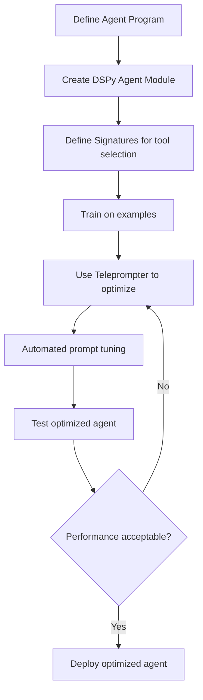

**Category:** AI Agent Development Frameworks
**Difficulty:** Intermediate
**Reading time:** 6 min read

---

DSPy is a framework for optimizing language model programs through structured prompting and automatic optimization. DSPy agents leverage this optimization infrastructure to improve agent performance iteratively, learning better prompts and tool selection strategies from data rather than relying on manual prompt engineering.

- **DSPy module** — Reusable, composable language model building block
- **Signature** — Formal specification of input/output for a module
- **Teleprompter** — Optimizer that improves module performance
- **Few-shot learning** — Learning from examples to improve performance
- **Automatic prompt tuning** — System-driven prompt optimization
- **Agent program** — DSPy representation of agent logic
- **Demonstration collection** — Gathering examples for optimization

DSPy agents are defined as modules that compose signatures (input/output specifications) and language model calls. Rather than handcrafted prompts, DSPy uses formal specifications of what modules should accomplish. A teleprompter optimizer analyzes performance on a set of examples and automatically improves prompts to better achieve desired behavior. For agents, this means optimizing the prompts that determine tool selection, parameter construction, and reasoning. The optimizer can try different templates, few-shot examples, and reasoning strategies, validating each against test data. This automated optimization often produces better results than manual prompt engineering, adapts to different models, and makes optimization reproducible. Developers define a validation function (e.g., does the agent's final answer match expected output?), and the teleprompter uses this signal to guide optimization.

- Performance-critical agent systems
- Iterative improvement of agent behavior
- Multi-model deployment (optimize per model)
- Research on optimal prompting strategies
- Systems requiring high accuracy on specific tasks
- Reducing manual prompt engineering effort
- Learning agent behavior from task-specific examples

| Advantage | Disadvantage |
|-----------|--------------|
| Automatic prompt optimization | Requires labeled examples for optimization |
| Better performance than manual prompts | Optimization can be expensive and slow |
| Model-agnostic optimization | Overfitting to training examples possible |
| Reproducible improvement process | Limited by quality and diversity of examples |
| Reduces manual engineering | Requires defining good validation functions |

- [DSPy signatures for agent tasks](dspy-signatures-for-agent-tasks.md)
- [LangChain agents and tools](langchain-agents-and-tools.md)
- [Agent evaluation frameworks](agent-evaluation-frameworks.md)

---
*Part of the [AI Agent Development Frameworks](index.md) category · [Back to Master Index](../../index.md)*
