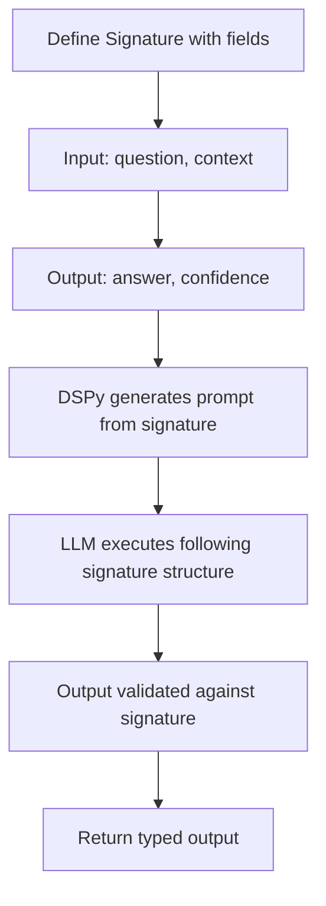

**Category:** AI Agent Development Frameworks
**Difficulty:** Intermediate
**Reading time:** 6 min read

---

DSPy signatures define formal specifications for agent tasks, describing required inputs and outputs. Signatures enable type safety, documentation, and automatic optimization, replacing handwritten prompts with machine-readable specifications that guide both agents and optimization systems.

- **Signature** — Formal input/output specification for a task
- **Input field** — Named input with type and description
- **Output field** — Named output with expected type and constraints
- **Field descriptors** — Human-readable descriptions helping models understand requirements
- **Docstring** — High-level task description
- **Type hints** — Python type information for validation
- **Signature composition** — Combining signatures for complex tasks

A DSPy signature is defined as a class with input and output fields. Each field includes a type hint and a human-readable description. For instance, an agent task signature might specify inputs like "question" (string) and "context" (list of documents), with outputs like "selected_tool" (string) and "tool_parameters" (dictionary). The signature's docstring describes the overall task. When a module uses a signature, DSPy generates a prompt template from this specification, allowing models to understand what's expected without ambiguity. The LLM processes this specification-based prompt and produces structured output. DSPy validates that outputs conform to the specified types, providing clear error messages if they don't. Multiple signatures can be composed—an agent might use one signature for tool selection, another for parameter generation, enabling modular task decomposition.

- Type-safe agent task definitions
- Documenting expected agent behavior
- Enabling automatic prompt generation
- Supporting optimization over task specifications
- Multi-step agent workflows with clear interfaces
- Agent testing and validation
- Research on optimal task specifications

| Advantage | Disadvantage |
|-----------|--------------|
| Type-safe specifications | Learning DSPy syntax overhead |
| Machine-readable task definitions | Less flexible than freeform prompts |
| Automatic prompt generation | Requires clear specification of outputs |
| Enables automatic optimization | Models may struggle with complex outputs |
| Clear documentation of expectations | Type validation can be restrictive |

- [DSPy optimized agents](dspy-optimized-agents.md)
- [LangChain structured chat agents](langchain-structured-chat-agents.md)
- [LangChain agents and tools](langchain-agents-and-tools.md)

---
*Part of the [AI Agent Development Frameworks](index.md) category · [Back to Master Index](../../index.md)*
