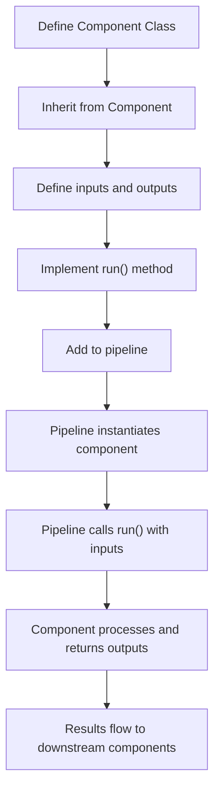

**Category:** AI Agent Development Frameworks
**Difficulty:** Intermediate
**Reading time:** 6 min read

---

Custom components in Haystack allow developers to extend the framework with specialized processing logic. By implementing the component interface, developers can integrate custom tools, models, or business logic seamlessly into Haystack pipelines, enabling domain-specific workflows without forking the framework.

- **Component interface** — Contract that custom components must implement
- **Input/output ports** — Typed connections between components
- **Component lifecycle** — Initialization, execution, and cleanup
- **Configuration** — Parameterizing components for reuse
- **Type safety** — Using Pydantic for input/output validation
- **Default values** — Component fallbacks and optional inputs
- **Documentation** — Making custom components discoverable and usable

Creating a custom component requires inheriting from Haystack's Component base class and defining the component's inputs and outputs using type annotations. The inputs are typically initialized in the __init__ method, while outputs are declared as class attributes with type information. The core logic resides in a run() method that accepts input values and returns a dictionary of output values. Haystack validates inputs against declared types, catches errors, and handles routing of outputs to downstream components. Custom components can be configured with parameters—for instance, a custom tool component might accept an API key and endpoint URL. Once defined, custom components are registered with Haystack and become available for inclusion in any pipeline. This design allows domain-specific logic to integrate cleanly with built-in components, enabling specialized workflows without modifying Haystack core.

- Integrating proprietary business logic into retrieval pipelines
- Wrapping external APIs and services
- Custom ranking and filtering logic
- Domain-specific NLP preprocessing
- Integration with enterprise systems
- Custom metric calculation and reporting
- Specialized knowledge base interactions

| Advantage | Disadvantage |
|-----------|--------------|
| Clean integration with Haystack ecosystem | Requires understanding component interface |
| Reusable across pipelines | Testing component interactions complex |
| Type-safe inputs and outputs | Limited to Haystack's execution model |
| Easy composition with built-in components | Debugging distributed component execution |
| Enables domain-specific customization | Maintenance burden for custom code |

- [Haystack pipelines for agents](haystack-pipelines-for-agents.md)
- [Haystack decision nodes](haystack-decision-nodes.md)
- [LangChain custom agent creation](langchain-custom-agent-creation.md)

---
*Part of the [AI Agent Development Frameworks](index.md) category · [Back to Master Index](../../index.md)*
