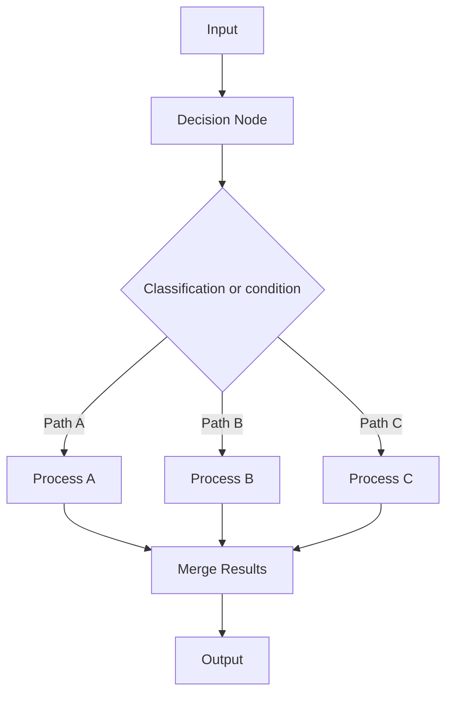

**Category:** AI Agent Development Frameworks
**Difficulty:** Intermediate
**Reading time:** 6 min read

---

Decision nodes in Haystack pipelines enable conditional branching based on component outputs or query properties. They allow workflows to follow different paths depending on conditions, enabling adaptive pipelines that route queries to appropriate processing chains based on classification or other decision criteria.

- **Decision node** — Component that evaluates conditions and routes flow
- **Conditional routing** — Directing data to different components based on conditions
- **Classifier-based routing** — Using ML models to determine routing decisions
- **Rule-based routing** — Hardcoded conditions determining flow
- **Output filtering** — Selecting specific pipeline branches based on results
- **Multi-way branching** — Supporting more than binary decisions
- **Metadata-driven routing** — Using document or query metadata for decisions

Decision nodes evaluate conditions on incoming data and determine which outgoing connections to activate. Rule-based decision nodes check hardcoded conditions—for instance, routing long documents to a hierarchical retriever while short queries go to fast vector search. Classifier-based decision nodes use machine learning models to categorize queries—a classifier might determine if a query is about products, support issues, or billing, routing accordingly. The decision node evaluates the incoming data, produces a routing decision, and activates appropriate downstream components. Multiple paths can execute in parallel if needed, with results merged downstream. This enables highly adaptive pipelines: a single pipeline definition can handle diverse query types, with different processing chains for different scenarios. Decision nodes reduce redundant processing by ensuring only necessary components execute.

- Query classification and routing
- Multi-tenant systems routing to tenant-specific pipelines
- A/B testing different processing approaches
- Fallback mechanisms (try fast retriever, fallback to comprehensive)
- Semantic vs. keyword search selection
- Language-specific processing
- Domain-specific pipeline selection

| Advantage | Disadvantage |
|-----------|--------------|
| Adaptive pipelines handling diverse inputs | Classifier errors affect downstream processing |
| Parallel processing of alternatives | Complex pipeline logic can be fragile |
| Reduced unnecessary computation | Decision logic can be hard to debug |
| Clean separation of concerns | Requires training/tuning classifiers |
| Easy to add new routing rules | Maintenance burden as rules grow |

- [Haystack pipelines for agents](haystack-pipelines-for-agents.md)
- [Haystack custom components](haystack-custom-components.md)
- [Machine learning fraud detection](../payment-security-fraud-prevention/machine-learning-fraud-detection.md)

---
*Part of the [AI Agent Development Frameworks](index.md) category · [Back to Master Index](../../index.md)*
